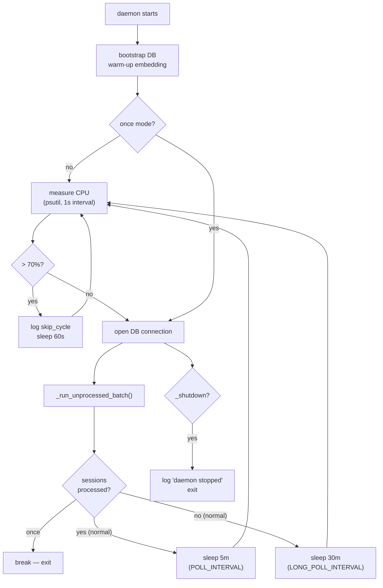
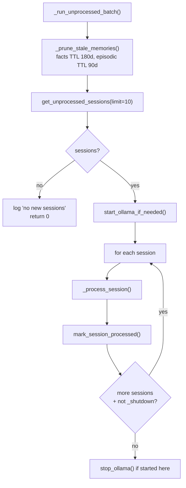
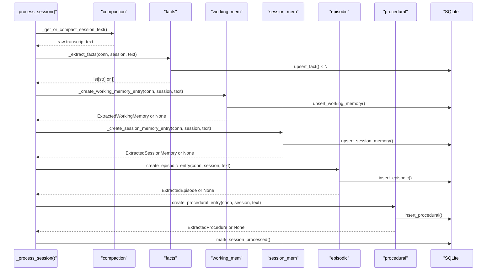
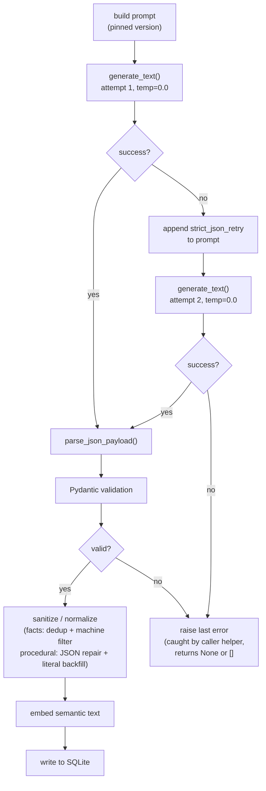
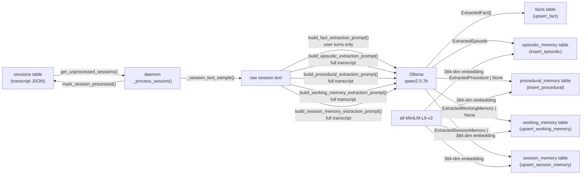

# Extraction Daemon — Unit Documentation

## 1. Summary

The extraction daemon is the background worker that converts raw session transcripts into
five types of durable structured memory. It runs as a long-lived macOS launchd service
(`com.memory.daemon`), polling SQLite every 5–30 minutes for unprocessed sessions and
running a sequential pipeline of five LLM-backed extractors — facts, working memory,
session memory, episodic memory, and procedural memory — on each one. The daemon writes
all extracted records back to SQLite and computes a 384-dimensional embedding for each,
enabling semantic retrieval at wake-up time. It also prunes stale records once per batch
cycle to keep the database lean. Ollama is started on demand at the beginning of each
batch and stopped when the batch completes.

Cross-cutting concerns (database schema, embedding model, retrieval, HTTP servers,
integrations) are documented in the [repository overview](../overview/overview.md).

---

## 2. Surface Overview

| Item | Module | Protocol | Invoked by |
|---|---|---|---|
| `run()` | `memory/daemon/__init__.py` | Python function | `memory/daemon/__main__.py`, tests |
| `process_one_unprocessed_session()` | `memory/daemon/__init__.py` | Python function | Dashboard server (`POST /api/process-one`) |
| `_process_session()` | `memory/daemon/__init__.py` | Internal | `run()`, `process_one_unprocessed_session()` |
| Facts extractor | `memory/facts/extractor.py` | Ollama HTTP | `_process_session()` |
| Episodic extractor | `memory/episodic/extractor.py` | Ollama HTTP | `_process_session()` |
| Procedural extractor | `memory/procedural/extractor.py` | Ollama HTTP | `_process_session()` |
| Working-memory extractor | `memory/working_memory/extractor.py` | Ollama HTTP | `_process_session()` |
| Session-memory extractor | `memory/session/extractor.py` | Ollama HTTP | `_process_session()` |
| `_compact_session_text()` | `memory/daemon/compaction.py` | Ollama HTTP | Available but unused in main path |
| `_prune_stale_memories()` | `memory/daemon/pruning.py` | SQLite | `_run_unprocessed_batch()` |
| `com.memory.daemon` | `com.memory.daemon.plist` | launchd | macOS launchd |

---

## 3. Detailed Documentation

### 3.1 Main Loop — `run()`

**Source:** `memory/daemon/__init__.py:457–490`

**Signature:** `run(once: bool = False) -> None`

**Purpose:** Long-running extraction loop. In default mode it polls SQLite every 5–30
minutes, applying a CPU gate before each cycle. In `--once` mode it performs exactly one
extraction pass and exits immediately, bypassing the CPU gate. `--once` is useful for
manual invocation and testing.

**Startup sequence:**
1. Sets `_shutdown = False` and logs `"daemon started"`.
2. Ensures `~/.memory/` exists (`os.makedirs`).
3. Calls `bootstrap_db(DB_PATH)` to create the schema if missing.
4. Calls `_warm_up_embedding()` to pre-load the sentence-transformer model before the
   first extraction.

**Loop body (default mode):**
1. Reads CPU utilisation with `psutil.cpu_percent(interval=1)`.
2. If CPU > 70 % (`CPU_THRESHOLD`; `memory/daemon/_core.py:20`), logs `skip_cycle` to
   the activity log and sleeps 60 s, then continues.
3. Opens a fresh SQLite connection (`open_db(DB_PATH)`).
4. Calls `_run_unprocessed_batch(conn)`.
5. Sleeps `POLL_INTERVAL` (5 min; `_core.py:18`) if sessions were processed, or
   `LONG_POLL_INTERVAL` (30 min; `_core.py:19`) if the queue was empty.
6. Closes the connection, repeats.

**Loop body (`once=True`):**
Skips the CPU gate, calls `_run_unprocessed_batch` once, then breaks.

**Shutdown:** SIGTERM or SIGINT sets `_shutdown = True`
(`memory/daemon/__init__.py:86–92`). The loop exits cleanly after the current session
finishes.

**Signals registered:**
```
signal.signal(signal.SIGTERM, _handle_sigterm)
signal.signal(signal.SIGINT, _handle_sigterm)
```
(`memory/daemon/__init__.py:92–93`)

---

### 3.2 Public API — `process_one_unprocessed_session()`

**Source:** `memory/daemon/__init__.py:425–454`

**Signature:** `process_one_unprocessed_session() -> dict`

**Purpose:** Processes a single unprocessed session synchronously. Called by the dashboard
server's `POST /api/process-one` endpoint so operators can trigger an extraction pass
without waiting for the next poll cycle.

**Behaviour:**
- Opens (or bootstraps) the SQLite DB.
- Fetches at most one unprocessed session.
- If none: returns `{"ok": True, "processed": False, "reason": "no_unprocessed_sessions"}`.
- Starts Ollama if needed, runs `_process_session()`, stops Ollama.
- On success: returns `{"ok": True, "processed": True, "session_id": <id>}`.
- On failure: logs the error and returns
  `{"ok": False, "processed": False, "session_id": <id>, "error": <message>}`.

---

### 3.3 Extraction Pipeline — `_process_session()`

**Source:** `memory/daemon/__init__.py:331–387`

Orchestrates the five extractors for one session. The full raw session transcript is
built once (`_get_or_compact_session_text`) and shared across all five extractors, avoiding
redundant I/O.

**Extractor order** (`memory/daemon/__init__.py:342–348`):

| Order | Function | Memory type |
|---|---|---|
| 1 | `_extract_facts` | Fact |
| 2 | `_create_working_memory_entry` | Working memory |
| 3 | `_create_session_memory_entry` | Session memory |
| 4 | `_create_episodic_entry` | Episodic memory |
| 5 | `_create_procedural_entry` | Procedural memory |

Each extractor is called with the shared `text_sample`. Before each call the daemon checks
`_shutdown` and aborts the loop early on SIGTERM.

Each extractor call is timed and the result emitted to the activity log as an
`extractor_timing` event (including `duration_ms`, `extractor` label, and `emitted`
flag).

After all five extractors complete (or are aborted by `_shutdown`),
`mark_session_processed(conn, session_id)` is called and a `processed` + `session_timing`
event is written to the activity log.

**Extractor isolation:** Each of the five helper functions (`_extract_facts`,
`_create_*_entry`) wraps its own internals in a try/except and returns `[]` or `None` on
failure (`memory/daemon/__init__.py:183–185`, `145–147`, `227–229`, `274–276`,
`320–322`). This means a single extractor failure — for example an LLM timeout — does not
abort the pipeline. The session is marked processed even if some extractors returned
nothing. The outer for-loop in `_process_session` also wraps each call in a try/except
and would raise `RuntimeError` if a function raised unexpectedly, but in practice the
internal catches prevent that.

---

### 3.4 Facts Extractor

**Source:** `memory/facts/extractor.py`, `memory/facts/repository.py`

**Purpose:** Extracts durable structured facts — entity/attribute/value triples — from the
user turns of a session transcript. Facts represent stable knowledge that should remain
useful across future sessions (user identity, preferences, explicit project metadata). They
are explicitly not requests, tasks, questions, or tool traces.

**Prompt:** `build_fact_extraction_prompt()` (`memory/facts/extractor.py:123`)
- Prompt version pinned to `facts-v7` (`extractor.py:26`).
- Filters the transcript to user turns only (`_extract_user_lines`; `extractor.py:91`).
  Assistant turns never reach the model.
- Includes extensive negative examples: requests, commands, tool traces, dashboard
  feature requests — all expected to return `[]`.

**LLM call:** `generate_text(GenerationRequest(prompt=..., temperature=0.0))`.
Up to two attempts: first with the base prompt, second with `_with_strict_json_retry()`
appended (`extractor.py:420–437`).

**Post-processing:**
1. `parse_json_payload` tolerates JSON wrapped in prose (`inference.py:97`).
2. Each item validated against `ExtractedFact` (Pydantic).
3. Machine-garbage filter removes shell/tool-trace facts (`_fact_is_machine_garbage`;
   `extractor.py:108`).
4. `normalize_extracted_facts` deduplicates exact triples (same entity+attribute+value)
   while preserving conflicts (same entity+attribute, different value)
   (`extractor.py:353–373`).

**Persistence:** `save_extracted_facts()` (`repository.py:54`)
- Calls `upsert_fact()` for each deduplicated fact.
- Tags: `memory_type:fact`, `origin:llm_extractor`, `entity:<e>`, `attribute:<a>`.
- Also stores a `semantic_content` field (model-generated retrieval text from
  `generate_semantic_fact_text`).
- Source label stored as `daemon_fact_extractor`.

**Semantic content:** `save_extracted_facts` calls `build_fact_semantic_content(fact)`,
which in turn calls `generate_semantic_fact_text` in `memory/facts/text.py` — a second
Ollama call per fact, distinct from the initial extraction call. The generated text is
stored in the `semantic_content` column. No 384-dim embedding is computed or stored at
write time (`save_extracted_facts` does not call `embed_fn`), unlike the other four memory
types.

**Log:** `~/.memory/facts.log` — one JSON line per extraction event.

---

### 3.5 Episodic Extractor

**Source:** `memory/episodic/extractor.py`, `memory/episodic/repository.py`

**Purpose:** Extracts one structured narrative of what happened in a session — a title,
1–2 sentence abstract, participants, decisions, outcomes, and follow-ups. Episodic memories
answer "what was done in this session?" and are the primary medium for recall when a user
resumes a related topic.

**Prompt:** `build_episodic_extraction_prompt()` (`episodic/extractor.py:69`)
- Prompt version `episodic-v2` (`extractor.py:25`).
- Uses the full transcript (user and assistant turns).
- Focuses on one main event per session; requires concrete, specific title (max 10 words).
- Preserves literal details: branch names, env vars, named people, percentages.

**LLM call:** Same two-attempt pattern as facts; `temperature=0.0`.

**Post-processing:**
- `parse_json_payload` + Pydantic validation against `ExtractedEpisode`.
- Returns one `ExtractedEpisode` (never `None`; raises `InferenceError` if both
  attempts fail).

**Persistence:** `save_extracted_episode()` (`repository.py:30`)
- Builds `build_episodic_semantic_text()` — a flat string joining title, abstract,
  participants, decisions, outcomes, follow-ups.
- Embeds that semantic text via `embed_fn` (default `embed_text`).
- Calls `insert_episodic()` with the episode fields, embedding, and JSON `details` blob.
- `happened_at` is set to `session.updated_at` (falling back to current UTC).

**TTL:** 90 days (env `MEMORY_EPISODIC_TTL_DAYS`; `_core.py:25`). Pruned by
`_prune_stale_memories()` at the start of each batch.

**Log:** `~/.memory/episodic.log` — JSON-line events for `extract_start`,
`extract_result`, `validation_error`, `persist_result`.

---

### 3.6 Procedural Extractor

**Source:** `memory/procedural/extractor.py`, `memory/procedural/repository.py`,
`memory/procedural/backfill.py`

**Purpose:** Extracts one durable how-to or workflow from a session — a title, summary,
ordered steps, trigger phrases, and tools. Procedural memories answer "how do I do X?" and
are designed to be surfaced when a user asks about a recurring workflow. If the session
does not contain a durable repeatable procedure, the model returns `{}` and the extractor
returns `None`.

**Prompt:** `build_procedural_extraction_prompt()` (`procedural/extractor.py:70`)
- Prompt version `procedural-v2` (`extractor.py:25`).
- Includes 10 worked examples covering deploy workflows, rollbacks, local setups, release
  checklists, backfill procedures, flaky-test triage, incident debug, and the negative
  case (one-off incident summaries → `{}`).

**LLM call:** Two-attempt pattern; `temperature=0.0`.

**Post-processing:**
- `_repair_common_json_string_escapes()` corrects unescaped quotes in string values that
  local models sometimes emit (`extractor.py:313`).
- Pydantic validation against `ExtractedProcedure`.
- `_enrich_procedure_literals()` backfills obvious stage names (`staging`, `preview`,
  `production`) and uppercase env-var tokens into the `tools` list when they appear in the
  extracted text but not in `tools` (`extractor.py:353`).
- Returns `None` when the model returns `{}` or `[]`.

**Persistence:** `save_extracted_procedure()` (`repository.py:27`)
- Builds `build_procedural_semantic_text()`: title, summary, steps, trigger phrases,
  tools joined as a flat string.
- Embeds and calls `insert_procedural()`.
- `updated_at` is set to `session.updated_at`.

**Backfill:** `backfill_procedural_memory()` (`backfill.py:82`) is a standalone utility
(not called by the daemon main loop) that re-extracts procedural memories for historical
sessions. It supports `--dry-run`, `--force` (re-extract even if a procedure exists), and
`--limit`. Called by scripts or the CLI; not part of the daemon's ongoing operation.

**Log:** `~/.memory/procedural.log` — same JSON-line event structure as episodic.

---

### 3.7 Working-Memory Extractor

**Source:** `memory/working_memory/extractor.py`, `memory/working_memory/repository.py`

**Purpose:** Extracts a point-in-time snapshot of the active goal, current focus,
unfinished tasks, constraints, next step, and status. Working memory captures the immediate
resumption context — what is actively in flight right now. If the session is fully
complete with no open work, the model returns `{}` and the extractor returns `None`.

**Prompt:** `build_working_memory_extraction_prompt()` (`working_memory/extractor.py:66`)
- Prompt version `working-memory-v1` (`extractor.py:26`).
- Status enum: `in_progress`, `blocked`, `ready_to_resume`, `done`.
- Uses `done` only when the transcript explicitly says work is wrapped up.

**LLM call:** Two-attempt pattern; `temperature=0.0`. Returns
`ExtractedWorkingMemory | None`.

**Persistence:** `save_extracted_working_memory()` (`repository.py:27`)
- Calls `upsert_working_memory()` (not insert — one record per session_id, replaced on
  re-extraction).
- Builds semantic text from goal, focus, tasks, next step, status, constraints.
- Embeds and stores the record with `updated_at`.

**Log:** `~/.memory/working_memory.log`.

---

### 3.8 Session-Memory Extractor

**Source:** `memory/session/extractor.py`, `memory/session/repository.py`

**Purpose:** Extracts a concise handoff record for a session: title, 1–2 sentence summary,
what was tried, outcomes, `left_off_at` (current end state), and next steps. Session memory
is the bridge between consecutive sessions on the same topic. If the transcript has no
meaningful resumable work, the model returns `{}` and the extractor returns `None`.

**Prompt:** `build_session_memory_extraction_prompt()` (`session/extractor.py:66`)
- Prompt version `session-memory-v1` (`extractor.py:26`).
- Distinguished from working memory: session memory summarises the whole session; working
  memory captures the immediate active context.

**LLM call:** Two-attempt pattern; `temperature=0.0`. Returns
`ExtractedSessionMemory | None`.

**Persistence:** `save_extracted_session_memory()` (`session/repository.py:25`)
- Calls `upsert_session_memory()` (upsert, keyed by session_id).
- Semantic text joins title, summary, `left_off_at`, `what_was_tried`, outcomes,
  `next_steps`.
- Embeds and stores; `min_similarity` for retrieval is 0.76 (`repository.py:128`), higher
  than episodic (0.72) and procedural (0.72).

**Log:** `~/.memory/session_memory.log`.

---

### 3.9 Compaction Module

**Source:** `memory/daemon/compaction.py`

Contains session text helpers. The central function is
`_get_or_compact_session_text()` which is the entry point used by `_process_session()`.

**Current behaviour:** The daemon intentionally skips LLM compaction.
`_get_or_compact_session_text()` delegates directly to `_session_text_sample()` and
returns the full raw transcript with no size limit and no LLM summarisation
(`compaction.py:75–83`). The `conn` parameter is accepted for backward compatibility and
discarded.

**`_session_text_sample(session)`** (`compaction.py:35`):
- Parses `session["transcript"]` as JSON.
- Builds the full turn-by-turn text via `_build_session_text(turns)` with no `max_chars`
  limit.

**`_build_session_text(turns, max_chars=None)`** (`compaction.py:18`):
- Concatenates `role: content` pairs for all turns with non-empty string content.
- If `max_chars` is set, stops when the budget is exceeded (used only if callers pass a
  limit explicitly).

**`_compact_session_text(full_text)`** (`compaction.py:44`):
- Sends up to `_COMPACT_INPUT_CHARS` (default 40 000; env `MEMORY_COMPACT_INPUT_CHARS`)
  characters to Ollama and requests a summary under `_COMPACT_OUTPUT_CHARS` (default
  5 000; env `MEMORY_COMPACT_OUTPUT_CHARS`) characters.
- Retained for optional or debug use but **not called** by the current daemon pipeline.
  The module docstring explains the rationale: compaction risks hallucinated details in
  downstream structured extraction.

---

### 3.10 Pruning Module

**Source:** `memory/daemon/pruning.py`

**`_prune_stale_memories(conn)`** (`pruning.py:11`):
- Calls `prune_stale_facts(conn, days=_FACT_TTL_DAYS)` — deletes `facts` rows whose
  `updated_at < cutoff` (`memory/db/facts.py:239`).
- Calls `prune_stale_episodic(conn, days=_EPISODIC_TTL_DAYS)` — deletes
  `episodic_memory` rows whose `happened_at < cutoff` (`memory/db/episodic.py:94`).
- Default TTLs: 180 days for facts (env `MEMORY_FACT_TTL_DAYS`; `_core.py:24`),
  90 days for episodic (env `MEMORY_EPISODIC_TTL_DAYS`; `_core.py:25`).
- Called once per batch at the start of `_run_unprocessed_batch()` — before Ollama
  starts.
- Failure is non-fatal: caught with `error_log` and execution continues (`pruning.py:27`).

**`_warm_up_embedding()`** (`pruning.py:30`):
- Calls `embed("warmup")` to force the sentence-transformer model to load before the
  first real embedding call.
- Failure is non-fatal and logged.

---

### 3.11 LLM Inference Seam

**Source:** `memory/llm/inference.py`

The single point of contact between all five extractors and the Ollama runtime.

**`generate_text(request: GenerationRequest) -> GenerationResult`** (`inference.py:52`):
- POSTs to `http://localhost:11434/api/generate` with `stream: false`.
- Model: `request.model or MEMORY_OLLAMA_MODEL env or "qwen2.5:7b"`.
- Temperature: `request.temperature` (all daemon extractors use `0.0` for determinism).
- Retries: up to `MEMORY_OLLAMA_RETRIES` (default 3; env; `inference.py:23`) with
  exponential backoff (1 s, 2 s, 4 s) on `URLError`.
- Timeout: `request.timeout_seconds` (default 120 s; extractors pass
  `_EXTRACTION_TIMEOUT_SECONDS`, default 600 s, env `MEMORY_EXTRACTION_TIMEOUT_SECONDS`).
- On final failure: raises `InferenceError`.

**`parse_json_payload(raw: str) -> list | dict`** (`inference.py:97`):
- Tries `json.loads` first.
- Falls back to scanning for the first `{` or `[` and decoding from that position.
- Tolerates prose preamble produced by local models.
- Returns `[]` if no JSON structure is found.

**`embed_text(text: str) -> list[float]`** (`inference.py:121`):
- Delegates to `memory.vectors.embed` (sentence-transformers `all-MiniLM-L6-v2`).
- Raises `InferenceError` on failure.

---

### 3.12 Ollama Lifecycle

**Source:** `memory/llm/ollama.py`

The daemon starts Ollama only when unprocessed sessions exist and stops it when the batch
completes, avoiding keeping the LLM process running during idle periods.

**`start_ollama_if_needed(log_fn)`** (`ollama.py:33`):
- Checks `/api/tags` with a 2 s timeout (`is_ollama_running`).
- If already running: returns `None` (daemon does not own the process).
- If not running: runs `ollama serve` via `subprocess.Popen`, then polls for up to 12 s
  (1 s intervals) for the API to respond.
- If Ollama does not become ready in 12 s: terminates the process and returns `None`.
- If `ollama` binary is not in PATH: logs and returns `None` without raising.

**`stop_ollama(proc, log_fn)`** (`ollama.py:69`):
- Calls `proc.terminate()`, waits up to 5 s.
- Falls back to `proc.kill()` on `TimeoutExpired`.

Both functions are called from `_run_unprocessed_batch()` in a try/finally block
(`__init__.py:402–420`), ensuring Ollama is stopped even if a session raises.

---

### 3.13 launchd Service

**Source:** `com.memory.daemon.plist`

| Property | Value |
|---|---|
| Label | `com.memory.daemon` |
| RunAtLoad | `true` — starts on plist load (system boot or manual `launchctl load`) |
| KeepAlive | `true` — relaunched automatically on unexpected exit |
| StandardOutPath | `~/.memory/daemon.log` |
| StandardErrorPath | `~/.memory/daemon.log` (merged) |
| Process title | `AgenticMemoryDaemon` (set by `setproctitle` in `__main__.py:15`) |

The plist uses `__PYTHON3__` and `__INSTALL_DIR__` placeholders substituted by
`install.sh` at install time.

**Invocation:** `python3 -m memory.daemon` (or `python3 -m memory.daemon --once`).
The `--once` flag is not part of the launchd plist; it is only used for manual CLI
invocation and tests.

---

## 4. Flow Diagrams

### 4.1 Main Loop Cycle

The diagram below shows one complete poll cycle in default mode.



### 4.2 Batch and Session Processing

One call to `_run_unprocessed_batch()` processes up to 10 sessions sequentially.



### 4.3 Session Extraction Pipeline

Five extractors run sequentially, sharing one session text build.



### 4.4 LLM Extraction Pattern (common to all five extractors)



---

## 5. Business Rules

| Rule | Meaning | Implementation | Source |
|---|---|---|---|
| CPU gate | Do not run extractions when the machine is busy (> 70 % CPU) | `psutil.cpu_percent(interval=1) > CPU_THRESHOLD` | `memory/daemon/__init__.py:474–479`, `memory/daemon/_core.py:20` |
| Batch limit | At most 10 sessions per poll cycle | `get_unprocessed_sessions(conn, limit=10)` | `memory/daemon/__init__.py:397` |
| Extraction timeout | Each extractor call is bounded at 600 s (default) | `MEMORY_EXTRACTION_TIMEOUT_SECONDS`; `__init__.py:83` | `memory/daemon/__init__.py:83` |
| Ollama lifecycle | Ollama is started on demand per batch, stopped after | `start_ollama_if_needed` / `stop_ollama` in try/finally | `memory/daemon/__init__.py:402–420` |
| Raw transcript as input | Extractors receive the full raw transcript, not an LLM-generated summary | `_get_or_compact_session_text` delegates to `_session_text_sample` | `memory/daemon/compaction.py:75–83` |
| Extractor isolation | A single extractor failure does not abort the pipeline | Each helper has an internal try/except; returns `None` or `[]` on error | `memory/daemon/__init__.py:145–147`, `183–185`, `227–229`, `274–276`, `320–322` |
| Fact: user turns only | Facts are extracted from user messages only; assistant turns never reach the model | `_extract_user_lines` filters to `user:` prefix lines | `memory/facts/extractor.py:91–105` |
| Fact: no machine garbage | Shell commands, tool traces, and command-like values are filtered from facts | `_fact_is_machine_garbage()` | `memory/facts/extractor.py:108–115` |
| Fact: dedup, keep conflicts | Exact (entity, attribute, value) triples are merged; differing values for the same attribute are both kept | `normalize_extracted_facts()` | `memory/facts/extractor.py:353–373` |
| Fact TTL | Facts older than 180 days are deleted | `prune_stale_facts(days=_FACT_TTL_DAYS)` | `memory/daemon/pruning.py:14`, `_core.py:24` |
| Episodic TTL | Episodic memories older than 90 days are deleted | `prune_stale_episodic(days=_EPISODIC_TTL_DAYS)` | `memory/daemon/pruning.py:15`, `_core.py:25` |
| Pruning non-fatal | A pruning failure is logged but does not abort the batch | try/except in `_prune_stale_memories` | `memory/daemon/pruning.py:27` |
| No procedure = None | When the session contains no durable repeatable procedure, the model returns `{}` and the extractor returns `None` | `parse_extracted_procedure` returns `None` for `{}` | `memory/procedural/extractor.py:385` |
| JSON repair | Unescaped double quotes in procedural model output are repaired before parsing | `_repair_common_json_string_escapes()` | `memory/procedural/extractor.py:313` |
| Stage literal backfill | `staging`, `preview`, `production` and uppercase env-var tokens are backfilled into `tools` from procedure text | `_enrich_procedure_literals()` | `memory/procedural/extractor.py:353` |
| Temperature pinned to 0 | All extractor LLM calls use `temperature=0.0` for deterministic output | `GenerationRequest(temperature=0.0)` in each extractor | `memory/facts/extractor.py:427`, `memory/episodic/extractor.py:235`, and analogously in the other three |
| Ollama 3-retry backoff | Transient Ollama HTTP errors trigger up to 3 attempts with 1 s / 2 s / 4 s backoff | `_MAX_RETRIES` loop with `time.sleep(2 ** attempt)` | `memory/llm/inference.py:23`, `68–94` |

---

## 6. Dependencies

| Dependency | Purpose | Protocol | Endpoint | Failure Behaviour |
|---|---|---|---|---|
| Ollama | LLM text generation for all five extractors | HTTP POST (JSON) | `http://localhost:11434/api/generate` | Retried 3× with exponential backoff; raises `InferenceError`; individual extractor returns `None`/`[]` |
| SQLite (`~/.memory/memory.db`) | Read unprocessed sessions; write all extracted records; mark sessions processed; prune stale records | stdlib sqlite3 | File on disk | `busy_timeout=5000 ms`; WAL mode (from schema setup); daemon exits with exception if DB cannot be opened |
| sentence-transformers `all-MiniLM-L6-v2` | Embed semantic text for episodic, procedural, working-memory, session-memory records | In-process | n/a | Warm-up failure is non-fatal; embedding failure for a record is caught and logged — the record is saved without an embedding |
| `psutil` | Measure CPU utilisation before each poll cycle | In-process | n/a | Failure would propagate and crash the loop [inferred — no explicit catch] |

---

## 7. Error Handling

| Failure Scenario | Detection | Daemon Behaviour | Session State |
|---|---|---|---|
| Ollama not running | `URLError` on first POST | `start_ollama_if_needed` attempts to launch it; if unavailable, `InferenceError` raised in `generate_text` | Extractor returns `None`/`[]`; session marked processed |
| Ollama transient network error | `URLError` | Retried up to 3× with backoff; raises `InferenceError` after all retries | Extractor returns `None`/`[]`; session marked processed |
| Model returns invalid JSON | `json.JSONDecodeError` | `parse_json_payload` scans for first JSON structure; if none found, `InferenceError` raised | Extractor returns `None`/`[]` on second attempt too; session marked processed |
| Pydantic validation failure | `ValidationError` | `InferenceError` raised; second attempt with stricter reminder prompt | If both attempts fail, extractor returns `None`/`[]` |
| Single extractor exception | `Exception` in helper function | Caught internally; `error_log` written; returns `None`/`[]` | Other extractors continue; session marked processed |
| All extractors raise (hypothetical) | Uncaught exception from helper | `_process_session` catches; `error_log` written; re-raises `RuntimeError` | Session remains unprocessed; next batch cycle retries |
| Pruning failure | Any `Exception` in `_prune_stale_memories` | Caught; `error_log` written; batch continues | No effect on session processing |
| Embedding failure | Any exception from `embed_fn` | Caught in repository save functions; logged; record saved without embedding | Record persisted; semantic search will not find it |
| High CPU | `psutil.cpu_percent > 70` | Cycle skipped; `skip_cycle` written to activity log; sleep 60 s | No sessions processed that cycle |
| SIGTERM received | `_shutdown = True` | Current extractor and session finish; loop exits after | Session currently in progress is marked processed |

---

## 8. Data Flow

The diagram shows data moving through the daemon for one session.



---

## 9. Known Gaps

| Item | Marker | Detail |
|---|---|---|
| Stale test comment on extraction order | `[confirm]` | `tests/test_daemon.py:94` contains the comment "Extractors now run in parallel (ThreadPoolExecutor), so completion order is non-deterministic." The actual production code in `memory/daemon/__init__.py:342–376` runs extractors sequentially in a for-loop. The `assertCountEqual` assertion is compatible with sequential execution, but the comment is misleading and should be updated. |
| `plist` template references stale path | `[confirm]` | `com.memory.daemon.plist` shows `__INSTALL_DIR__/memory/daemon.py` as the program argument — a flat module path that no longer exists since the refactor moved the daemon into a package (`memory/daemon/__main__.py`). The `install.sh` script was fixed (commit `7df34ac`), but the template plist still contains the old path. If someone installs by substituting the plist template directly (bypassing `install.sh`), the daemon will fail to launch. |
| Working-memory and session-memory TTL | `[unknown]` | `_prune_stale_memories()` deletes only facts and episodic memories. Working-memory, session-memory, and procedural records have no TTL-based pruning in the daemon. Whether this is intentional is not determinable from the repository. |
| Fact semantic search | `[confirm]` | Facts store Ollama-generated `semantic_content` text but no 384-dim embedding. Whether fact retrieval uses this text for semantic search (e.g. via FTS or some other mechanism) is not visible in the daemon's own code path. Confirm whether `upsert_fact` stores an embedding or relies solely on FTS/structured retrieval. |
| Extraction timeout per extractor vs. per session | `[confirm]` | `_EXTRACTION_TIMEOUT_SECONDS` (default 600 s) is passed to each individual extractor. There is no aggregate timeout for the entire session. A session with five slow extractors could therefore take up to 5 × 600 s = 3 000 s. Whether this is intentional is not stated. |
| Procedural backfill not triggered by daemon | `[confirm]` | `backfill_procedural_memory()` exists in `memory/procedural/backfill.py` and is documented as a one-off utility for historical sessions. Confirm that the intent is never to call it from the daemon main loop. |

---

## 10. Provenance

Generated from `agentic-memory` @ `7df34ac` (`refactor-integrations-pi-claude-memory`)
on 2026-09-18. Regenerate rather than hand-edit.
