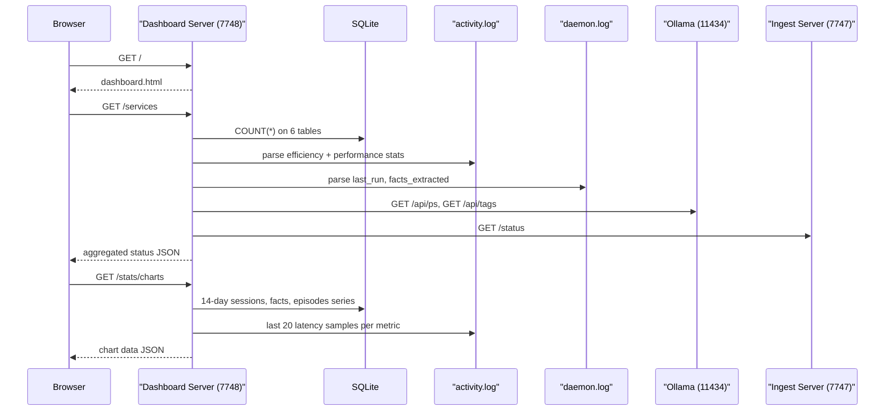
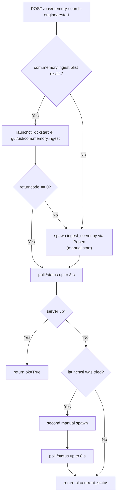
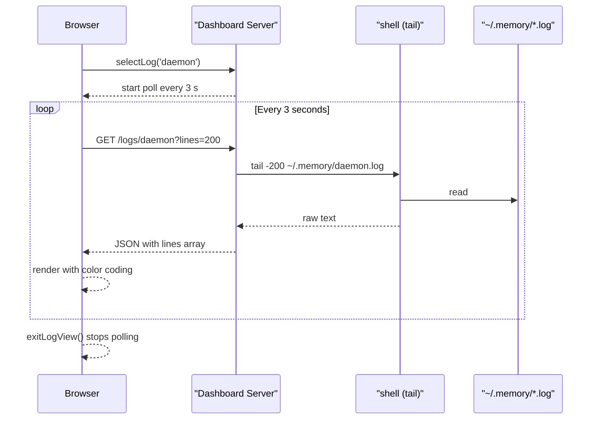
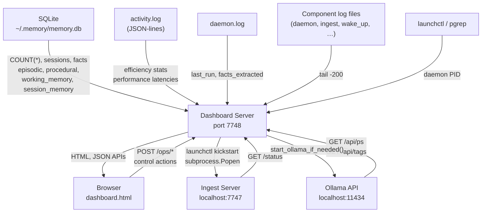

# Dashboard — agentic-memory

## 1. Summary

The dashboard unit is a self-contained administrative plane for the agentic-memory system. It
has two parts that work together: `memory/servers/dashboard_server.py`, a FastAPI HTTP server
(port 7748) that exposes a read-mostly API over the SQLite memory store plus operational
controls for the three co-running services; and `dashboard.html`, a single-page application
served by that same server that presents the same data through a tab-based UI with inline SVG
charts and a live log viewer. Together they let a developer or operator inspect every stored
memory artifact, monitor service health, trigger an on-demand daemon extraction pass, restart
Ollama or the Memory Search Engine, and tail any of the nine subsystem log files, all without
leaving the browser.

---

## 2. Surface Overview

All routes are served on port 7748 (default). No authentication or authorization is applied;
the server binds to `127.0.0.1` only (`memory/servers/dashboard_server.py:1046`).

| Method | Path | Router | Purpose |
|--------|------|--------|---------|
| GET | `/` | ui_router | Serve `dashboard.html` |
| GET | `/services` | ui_router | Aggregate status of all services, memory counts, efficiency and performance stats |
| GET | `/status` | ui_router | Minimal health-check with session count and DB size |
| GET | `/stats/charts` | ui_router | 14-day activity series and recent latency samples for charts |
| GET | `/memory/sessions` | memory_router | All sessions, each with a 200-char first-user-turn preview |
| GET | `/memory/sessions/{session_id}/transcript` | memory_router | One session with full transcript |
| GET | `/memory/facts` | memory_router | All facts with canonical and semantic content |
| GET | `/memory/episodic` (alias `/memory/episodes`) | memory_router | All episodic memories |
| GET | `/memory/procedural` | memory_router | All procedural memories |
| GET | `/memory/working-memory` (alias `/memory/working`) | memory_router | All working-memory snapshots |
| GET | `/memory/session-memory` (aliases `/memory/session-memory/compacted`, `/memory/sessions/compacted`) | memory_router | All session-memory handoffs |
| GET | `/logs/{service}` | ops_router | Tail the last N lines of one log file (N default 200) |
| POST | `/ops/daemon/process-one` | ops_router | Trigger one daemon extraction pass immediately |
| POST | `/ops/ollama/start` | ops_router | Start Ollama if not already running |
| POST | `/ops/memory-search-engine/restart` | ops_router | Restart the Memory Search Engine (ingest server) |

**Log sources** accepted by `GET /logs/{service}`:

| Key | Label | File |
|-----|-------|------|
| `daemon` | Daemon | `~/.memory/daemon.log` |
| `memory_search_engine` | Memory Search Engine | `~/.memory/ingest.log` |
| `wake_up` | Wake Up | `~/.memory/wake_up.log` |
| `save_hook` | Save Hook | `~/.memory/save_hook.log` |
| `facts` | Facts | `~/.memory/facts.log` |
| `episodic` | Episodes | `~/.memory/episodic.log` |
| `procedural` | Procedural | `~/.memory/procedural.log` |
| `working_memory` | Working Memory | `~/.memory/working_memory.log` |
| `session_memory` | Session Memory | `~/.memory/session_memory.log` |

Source: `memory/servers/dashboard_server.py:56-102`.

---

## 3. Detailed Documentation

### 3.1 `GET /`

Reads `dashboard.html` from `PROJECT_ROOT/dashboard.html` and returns it as an `HTMLResponse`.
`PROJECT_ROOT` is resolved relative to the server script's location
(`memory/servers/dashboard_server.py:29`). If the file is not found it returns a plain-HTML
error page (`memory/servers/dashboard_server.py:446-454`).

No query parameters. No authentication.

---

### 3.2 `GET /services`

The primary polling endpoint. The dashboard JavaScript calls this every 30 seconds
(`dashboard.html:362`). It aggregates status from four subsystems in a single response:

**Subsystems queried:**

| Subsystem | How checked |
|-----------|-------------|
| Daemon | `launchctl list com.memory.daemon`, then `pgrep -x AgenticMemoryDaemon` fallback (`memory/servers/dashboard_server.py:125-150`) |
| Ollama | `GET http://localhost:11434/api/ps` for active model; `GET http://localhost:11434/api/tags` for installed models (`memory/servers/dashboard_server.py:153-176`) |
| Memory Search Engine | `GET http://127.0.0.1:{RECALL_PORT}/status` (`memory/servers/dashboard_server.py:183-219`) |
| SQLite | Direct `COUNT(*)` queries on all six tables (`memory/servers/dashboard_server.py:474-483`) |

**Response shape (top-level keys):**

| Key | Contents |
|-----|----------|
| `daemon` | `running`, `pid`, `last_run` (ISO from daemon.log), `facts_extracted` (cumulative from daemon.log), `unprocessed_sessions`, `process_one_endpoint` |
| `ollama` | `running`, `model`, `installed_models`, `default_model`, `only_small_model_installed`, `warning`, `pull_recommendation`, `start_command`, `start_endpoint` |
| `memory_search_engine` | `running`, `status` (`running`/`degraded`/`stopped`/`unreachable`), `port`, `embed_model_ready`, `embed_model_name`, `embed_model_error`, `db_path`, `db_exists`, `display_name`, `restart_command`, `restart_endpoint` |
| `logs` | Array of log source descriptors (name, label, description, path, exists, size_bytes) |
| `efficiency` | `llm_calls_avoided`, `est_tokens_saved`, `metric`, `method` |
| `performance` | `recall_embedding_avg_ms`, `memory_search_avg_ms`, `daemon_session_avg_ms`, plus `_p95_ms` variants |
| `memory` | `total_sessions`, `total_facts`, `total_episodes`, `total_procedures`, `total_working_memory`, `total_session_memory`, `db_size_bytes` |

The `efficiency` and `performance` fields are both read from `~/.memory/activity.log` via two
cached parsers (see section 5.1). The `last_run` and `facts_extracted` fields are parsed from
`~/.memory/daemon.log` (`memory/servers/dashboard_server.py:263-282`).

---

### 3.3 `GET /status`

Returns a minimal status payload suitable for a health probe:

```json
{
  "status": "ok",
  "total_sessions": 42,
  "newest_session": "2026-09-18T12:00:00",
  "db_size_bytes": 1048576
}
```

`total_sessions` and `newest_session` come from a single `SELECT COUNT(*), MAX(updated_at)
FROM sessions` query (`memory/servers/dashboard_server.py:541-543`). Returns `status: "ok"`
even when the DB query fails; counts default to 0 in that case.

---

### 3.4 `GET /stats/charts`

Supplies data for the six charts on the Overview panel:

| Series | Query | Window |
|--------|-------|--------|
| `sessions_by_day` | `SELECT DATE(started_at), COUNT(*) FROM sessions GROUP BY day` | Last 14 days |
| `facts_by_day` | `SELECT DATE(created_at), COUNT(*) FROM facts GROUP BY day` | Last 14 days |
| `episodes_by_day` | `SELECT DATE(happened_at), COUNT(*) FROM episodic_memory GROUP BY day` | Last 14 days |
| `recall_embedding_ms_recent` | Parsed from activity.log | Last 20 samples |
| `memory_search_ms_recent` | Parsed from activity.log | Last 20 samples |
| `daemon_session_ms_recent` | Parsed from activity.log | Last 20 samples |

Source: `memory/servers/dashboard_server.py:558-612`. Returns HTTP 500 with a detail string on
any exception.

The dashboard JS fills missing days with zeros using a 14-day window so the charts always show
a full two-week history (`dashboard.html:566-576`).

---

### 3.5 `GET /memory/sessions`

Returns all sessions ordered by `updated_at DESC` with a 200-character preview derived from the
first user turn in the stored transcript JSON (`memory/servers/dashboard_server.py:615-651`).
No pagination — the full list is returned and filtered client-side.

**Response:**

```json
{
  "sessions": [
    {
      "session_id": "...",
      "agent": "claude",
      "turn_count": 14,
      "started_at": "2026-09-01T10:00:00",
      "updated_at": "2026-09-01T11:30:00",
      "preview": "First 200 chars of first user message…"
    }
  ],
  "total": 1
}
```

---

### 3.6 `GET /memory/sessions/{session_id}/transcript`

Returns full session metadata plus the deserialized turn array. If the session is not found,
returns `{"error": "session not found"}` with HTTP 200 (not 404)
(`memory/servers/dashboard_server.py:663-664`). DB exceptions are also returned as
`{"error": "..."}` with HTTP 200.

**Response fields:** `session_id`, `agent`, `turn_count`, `started_at`, `updated_at`,
`transcript` (array of `{role, content}` objects).

---

### 3.7 `GET /memory/facts`

Returns all facts ordered by `created_at DESC`. The `content` field is built by
`build_canonical_fact_content(entity, attribute, value)` from `memory.facts.text`
(`memory/servers/dashboard_server.py:699`). Tags are deserialized from JSON; malformed tags
default to an empty list.

**Response fields per fact:** `id`, `content` (canonical), `semantic_content`, `entity`,
`attribute`, `value`, `tags`, `source`, `session_id`, `created_at`, `updated_at`.

---

### 3.8 `GET /memory/episodic` (alias: `/memory/episodes`)

Returns all episodic memories ordered by `happened_at DESC`. The `details` JSON blob is
expanded into `participants`, `decisions`, `outcomes`, `follow_ups`, `confidence`,
`source_quote`, `source` (`memory/servers/dashboard_server.py:718-752`).

**Response:** `{"episodes": [...], "episodic": [...], "total": N}` — both keys contain the same
array for compatibility with clients that expect either name.

---

### 3.9 `GET /memory/procedural`

Returns all procedural memories ordered by `updated_at DESC`. The `details` blob is expanded
into `steps`, `tools`, `trigger_phrases`, `source`
(`memory/servers/dashboard_server.py:755-785`).

---

### 3.10 `GET /memory/working-memory` (alias: `/memory/working`)

Returns all working-memory snapshots ordered by `updated_at DESC`. The `details` blob is
expanded into `active_tasks`, `constraints`, `confidence`, `source_quote`, `source`
(`memory/servers/dashboard_server.py:788-822`).

---

### 3.11 `GET /memory/session-memory`

Three aliased paths all resolve to the same handler:
`/memory/session-memory`, `/memory/session-memory/compacted`, `/memory/sessions/compacted`.
Returns all session-memory handoffs ordered by `updated_at DESC`, with `details` expanded into
`what_was_tried`, `outcomes`, `next_steps`, `confidence`, `source_quote`, `source`
(`memory/servers/dashboard_server.py:825-860`).

---

### 3.12 `GET /logs/{service}?lines=200`

**Parameters:**
- `service` (path) — must be one of the nine keys in `_LOG_SOURCES`; returns HTTP 404 otherwise
- `lines` (query) — integer, default 200; number of lines to tail

The handler resolves the log file path, shells out `tail -{lines} {path}`, and returns the
result. Each non-separator line receives a trailing `"=" * 60` separator via
`_with_log_partitions()` (`memory/servers/dashboard_server.py:230-238`).

**Response:**

```json
{
  "service": "daemon",
  "exists": true,
  "path": "/Users/…/.memory/daemon.log",
  "candidates": ["/Users/…/.memory/daemon.log"],
  "lines": ["line 1", "============…", "line 2", "============…"]
}
```

If the file does not exist, `exists: false` is returned with an empty `lines` array. On shell
error, returns HTTP 500.

The dashboard polls this endpoint every 3 seconds while a log is open
(`dashboard.html:505-506`). The client-side `logLineClass()` function colorizes lines matching
`ERROR`/`CRITICAL`/`Traceback` (red), `WARN`/`WARNING` (amber), and separator lines (muted)
(`dashboard.html:917-923`).

---

### 3.13 `POST /ops/daemon/process-one`

Imports and calls `process_one_unprocessed_session()` from `memory.daemon` at request time
(deferred import to avoid circular import at module load). On success, re-queries the
unprocessed session count and appends it to the result
(`memory/servers/dashboard_server.py:878-894`).

**Response** (on success): the dict returned by `process_one_unprocessed_session()` plus
`unprocessed_sessions: N`.

---

### 3.14 `POST /ops/ollama/start`

Calls `start_ollama_if_needed()` from `memory.llm.ollama`, then re-checks Ollama status.
Returns current state regardless of whether a new process was spawned
(`memory/servers/dashboard_server.py:863-875`).

**Response fields:** `ok`, `running`, `model`, `installed_models`, `default_model`,
`started_here` (true when a new process was spawned), `start_command`.

---

### 3.15 `POST /ops/memory-search-engine/restart`

Restart logic in priority order (`memory/servers/dashboard_server.py:897-991`):

1. If `~/Library/LaunchAgents/com.memory.ingest.plist` exists, runs
   `launchctl kickstart -k gui/{uid}/com.memory.ingest`.
2. If launchctl fails (non-zero return code) or the plist is absent, spawns the ingest server
   script manually via `subprocess.Popen`, detached with `start_new_session=True`, stdout+stderr
   appended to `~/.memory/ingest.log`.
3. Polls `GET /status` on the recall server for up to 32 × 0.25 s = 8 seconds.
4. If the server is still not up after 8 seconds and launchctl was used in step 1, falls back
   to a second manual spawn and re-polls for another 8 seconds.

Returns the current `_check_recall_server()` payload plus `ok`, `started_here`, `pid`, and
`restart_command`.

---

## 4. Flow Diagrams

### 4.1 Dashboard page load

The following diagram shows the sequence of API calls the browser makes when the dashboard
page first loads.



### 4.2 Recall server restart

The following diagram shows the restart flow for `POST /ops/memory-search-engine/restart`.



### 4.3 Log viewer polling

The following diagram shows the live log-tailing loop.



---

## 5. Business Rules

| Rule | Business Meaning | Implementation | Source |
|------|------------------|----------------|--------|
| Only `memory_answer` actions count as LLM calls avoided | A recall that directly answers a question (no LLM needed) is the value the system provides | `if payload.get("action") != "memory_answer": continue` | `memory/servers/dashboard_server.py:309` |
| Token savings use a chars/4 heuristic | Approximate token count from character count; documented in the API response as an estimate | `int(payload.get("tokens_saved_estimate") or 0)` summed; `method` field states "~chars/4 heuristic" | `memory/servers/dashboard_server.py:312-313`, `:521` |
| Performance charts show only the 20 most recent samples | Keeps charts readable and avoids unbounded growth; older samples are discarded at parse time | `recall_embedding = recall_embedding[-20:]` | `memory/servers/dashboard_server.py:422-424` |
| Log view shows last 200 lines by default | Enough for diagnosis without sending megabytes over localhost | `lines: int = 200` default query parameter | `memory/servers/dashboard_server.py:995` |
| `qwen2.5:3b`-only installs trigger a warning and pull recommendation | The 3 B model produces weaker extraction; the dashboard surfaces this for the operator | `only_small_model_installed = ollama_installed_models == ["qwen2.5:3b"]` | `memory/servers/dashboard_server.py:490-492` |
| Activity log stats are cached by file mtime+size | Avoids re-parsing a potentially large log file on every `/services` or `/stats/charts` call | `if _ACTIVITY_STATS_CACHE["mtime"] == mtime and … ["size"] == size: return cached` | `memory/servers/dashboard_server.py:295-296` |
| Memory Search Engine status is `"degraded"` when the embedding model is not ready | The server is up but cannot serve semantic recall — a partial failure distinct from "stopped" | `status = "running" if embed_ready else "degraded"` | `memory/servers/dashboard_server.py:209` |

---

## 6. Dependencies

| Dependency | Purpose | Protocol | Failure Behavior |
|------------|---------|----------|-----------------|
| SQLite at `~/.memory/memory.db` | All memory data reads and count queries | In-process via `memory.db.open_db` | Exceptions silently caught; endpoints return empty lists or zero counts |
| Ollama at `http://localhost:11434` | Model and status queries for `/services` | HTTP with 2 s timeout | Exceptions caught; `running=False` returned |
| Memory Search Engine at `http://127.0.0.1:{RECALL_PORT}` | Embed-model readiness check for `/services` | HTTP with 2 s timeout | Exceptions caught; `running=False`, `status="stopped"` returned |
| `launchctl` (macOS) | Daemon detection and ingest server restart | subprocess, 5 s timeout | Process errors caught; falls back to `pgrep` or manual spawn |
| `pgrep` (macOS) | Daemon detection fallback | subprocess, 5 s timeout | Exceptions caught; returns `(False, None)` |
| `tail` (shell) | Log tailing for `GET /logs/{service}` | subprocess, 5 s timeout | Returns HTTP 500 with exception detail |
| `memory.daemon.process_one_unprocessed_session` | On-demand extraction trigger | In-process Python call | Not explicitly caught — exception propagates as HTTP 500 `[inferred]` |
| `~/.memory/activity.log` | Efficiency and performance statistics | File read | Returns zero stats if file absent or unreadable |
| `~/.memory/daemon.log` | Last-run timestamp and facts count | File read | Returns `(None, 0)` if file absent |

---

## 7. Error Handling

| Failure Scenario | Detection | Application Behavior | Client Response |
|-----------------|-----------|----------------------|-----------------|
| SQLite DB absent or unreadable | Exception in `open_db()` or query | Silently caught | Memory counts return as 0; memory list endpoints return empty arrays |
| Session not found by ID | `fetchone()` returns None | Returns `{"error": "session not found"}` | HTTP 200 with error key |
| Unknown log source key | Key not in `_LOG_SOURCES` | Raises `HTTPException(404)` | HTTP 404 |
| Log file not yet created | `os.path.exists()` returns False | Returns `exists: false`, empty lines, candidates list | HTTP 200 with empty lines |
| `tail` subprocess error | Exception from `subprocess.run` | Raises `HTTPException(500)` | HTTP 500 |
| `/stats/charts` DB error | Exception in query or connection | Raises `HTTPException(500, detail=str(exc))` | HTTP 500 |
| Ollama not running | HTTP error or connection refused | Exceptions caught in `_check_ollama()` | `running: false` in `/services` response |
| Recall server not running | HTTP error or connection refused | Exceptions caught in `_check_recall_server()` | `status: "stopped"` in `/services` response |
| Restart poll timeout | 8 s elapsed with no server up | Returns `ok: bool(status.running)` — may be False | HTTP 200 with `ok: false` |
| `dashboard.html` not found | `FileNotFoundError` | Returns plain HTML error page | HTTP 200 with error text |

---

## 8. Data Flow

The following diagram shows how the dashboard server reads and routes data.



---

## 9. Configuration

| Variable | Purpose | Default | Source |
|----------|---------|---------|--------|
| `MEMORY_QUERY_PORT` | Dashboard server listen port | `7748` | `memory/servers/dashboard_server.py:27` |
| `MEMORY_INGEST_PORT` | Recall server port for health checks and restart | `7747` | `memory/servers/dashboard_server.py:28` |
| `MEMORY_OLLAMA_MODEL` | Default Ollama model name shown in UI and warnings | `qwen2.5:7b` | `memory/servers/dashboard_server.py:489` |
| DB path | SQLite database location | `~/.memory/memory.db` (hard-coded) | `memory/servers/dashboard_server.py:25` |
| Activity log path | Source for efficiency and performance stats | `~/.memory/activity.log` (hard-coded) | `memory/servers/dashboard_server.py:32` |
| Dashboard HTML path | Served from `PROJECT_ROOT/dashboard.html` | resolved relative to script | `memory/servers/dashboard_server.py:29,448` |

---

## 10. Deployment

The dashboard server runs as a macOS launchd user agent (`com.memory.query.plist`):

| Property | Value |
|----------|-------|
| Label | `com.memory.query` |
| `RunAtLoad` | `true` — starts on login |
| `KeepAlive` | `true` — restarts automatically on crash |
| stdout / stderr | `~/.memory/query.log` |
| Python path | Written at install time by `install.sh` |

The server is started via:

```
uvicorn.run(app, host="127.0.0.1", port=PORT, log_level="info")
```

(`memory/servers/dashboard_server.py:1046`)

On startup, the lifespan handler creates `~/.memory/` and calls `bootstrap_db(DB_PATH)` to
ensure the schema exists before any request is served
(`memory/servers/dashboard_server.py:1028-1033`).

---

## 11. Testing

Test coverage is in `tests/test_dashboard_server.py`. All tests use `unittest.mock.patch` —
no live DB or subprocess is needed.

| Test class | What is covered |
|------------|-----------------|
| `TestDashboardDaemonDetection` | `_check_daemon()` primary launchctl path and `pgrep` fallback |
| `TestDashboardServices` | `get_services()` full payload shape; `start_ollama()` response; `restart_recall_server()` manual and fallback paths; `process_one_daemon_session()` result shape |
| `TestDashboardActivityStats` | `_parse_activity_log()` sums only `memory_answer` actions; `_parse_performance_activity_log()` latency sample extraction |
| `TestDashboardChartStats` | `get_chart_stats()` 14-day series + performance series |
| `TestDashboardLogFormatting` | `_with_log_partitions()` separator insertion |
| `TestDashboardHtml` | Confirms key element IDs and button labels are present in the served HTML |

Run with:

```
python -m pytest tests/test_dashboard_server.py
```

**Notable coverage gaps:**

- `GET /memory/sessions`, `GET /memory/facts`, and the other read-only memory endpoints have no
  dedicated tests; their behavior is relied on implicitly via the test of `get_services()`.
- The log endpoint (`GET /logs/{service}`) is not directly tested.
- The `GET /status` endpoint is not tested.

---

## 12. Dashboard UI Reference

`dashboard.html` is a self-contained single-page application (no external JavaScript
libraries; no build step). All chart rendering uses inline SVG generated by JavaScript.

### Layout

```
┌──────────────────┬────────────────────────────────────────┐
│  Sidebar (230 px)│  Tab bar                               │
│                  ├────────────────────────────────────────┤
│  Log source list │  Active panel (Overview / Sessions /   │
│  with status     │  Facts / Episodes / Procedural /       │
│  dots            │  Working / Session Memory)             │
│                  │                    OR                  │
│                  │  Log viewer (replaces panels+tabs)     │
└──────────────────┴────────────────────────────────────────┘
```

### Tabs and panels

| Tab | Panel ID | API called on first visit | Search field |
|-----|----------|--------------------------|--------------|
| Overview | `panel-overview` | `/services`, `/stats/charts` on load | — |
| Sessions | `panel-sessions` | `GET /memory/sessions` | `srch-sessions` |
| Facts | `panel-facts` | `GET /memory/facts` | `srch-facts` |
| Episodes | `panel-episodes` | `GET /memory/episodes` | `srch-episodes` |
| Procedural | `panel-procedural` | `GET /memory/procedural` | `srch-procedural` |
| Working | `panel-working` | `GET /memory/working-memory` | `srch-working` |
| Session Memory | `panel-session-memory` | `GET /memory/session-memory` | `srch-session-memory` |

Data for each tab is loaded once on first visit and held in module-level arrays; it is not
refreshed again unless a "Process One Session" action is triggered, which reloads all loaded
tabs (`dashboard.html:450-457`).

### Log viewer

Clicking any item in the sidebar log list replaces the tab panels with a log viewer. The viewer
polls `GET /logs/{source}?lines=200` every 3 seconds (`dashboard.html:505`) and colorizes
output: red for `ERROR`/`CRITICAL`/`Traceback`, amber for `WARN`, muted grey for `=…=`
separator lines (`dashboard.html:917-923`). Clicking "Back" returns to the last active tab.

### Overview panel sections

| Section | Data source | Description |
|---------|-------------|-------------|
| Runtime | `/services` | Three tiles: Memory Search Engine, Ollama, Daemon — each with status, action buttons, and key metadata |
| Savings | `/services` | LLM calls avoided and estimated tokens saved from direct memory answers |
| Performance | `/services` + `/stats/charts` | Avg and p95 tiles for prompt embedding, memory search, and daemon session latency; three bar charts |
| Memory | `/services` | Seven clickable count tiles (sessions, facts, episodes, procedural, working, session memory, DB size) |
| Activity charts | `/stats/charts` | Sessions per Day, Facts per Day, Episodes per Day over the last 14 days |

### UI polling schedule

| Activity | Interval |
|----------|----------|
| `/services` refresh | Every 30 seconds (`dashboard.html:362`) |
| Log line fetch | Every 3 seconds while a log is open (`dashboard.html:505`) |
| `/stats/charts` | On page load only; re-triggered by "Process One Session" |

---

## 13. Known Gaps

- `[confirm]` **Session read endpoints return HTTP 200 for missing sessions.** `GET /memory/sessions/{session_id}/transcript` returns `{"error": "session not found"}` with status 200, not 404. Whether this is intentional or an oversight requires human confirmation.
- `[confirm]` **No pagination on memory list endpoints.** All six memory-list endpoints (`/memory/sessions`, `/memory/facts`, etc.) return the full table contents in one response. For large databases this could be slow. Whether a pagination mechanism is planned is not determinable from the repository.
- `[confirm]` **No authentication.** The server binds to `127.0.0.1` only, which limits exposure. Whether additional authentication is planned is not determinable from the repository.
- `[unknown]` **`/memory/sessions/compacted` alias.** This path is registered as an alias for `GET /memory/session-memory` (`memory/servers/dashboard_server.py:827`). Its presence under the `/memory/sessions/` prefix could conflict with the `GET /memory/sessions/{session_id}/transcript` route for a `session_id` value of `"compacted"`. FastAPI route priority resolves this in favor of the literal segment `"compacted"`, but the intent is not documented.
- `[unknown]` **`process_one_unprocessed_session` failure mode.** The `POST /ops/daemon/process-one` handler does not catch exceptions from `process_one_unprocessed_session()`. Whether that function can raise, and what the client would receive, is not determinable from this unit.
- `[inferred]` **Plist path discrepancy.** `com.memory.query.plist` references `memory/dashboard_server.py` as the script path (`com.memory.query.plist:14`), but the actual path after the module refactoring is `memory/servers/dashboard_server.py`. `install.sh` writes the path at install time; the template uses `__INSTALL_DIR__/memory/dashboard_server.py` which may be wrong if `install.sh` was not updated. See Documentation Drift below.

---

## 14. Documentation Drift

**Plist script path vs. actual file location.**

`com.memory.query.plist` line 14 contains:

```
<string>__INSTALL_DIR__/memory/dashboard_server.py</string>
```

The server was moved to `memory/servers/dashboard_server.py` as part of the module refactoring
(`064793e`, `49bfe60`). If `install.sh` still writes the old path at install time, the launchd
service will fail to start. The git log commit `7df34ac` (`Fix install.sh launchd plists for
refactored module layout`) suggests this was addressed in `install.sh`, but the plist template
on disk still shows the old path. A human should verify that `install.sh` substitutes the
correct path and that the installed plist is current.

**_recon.md route paths.**

`docs/generated/_recon.md` lists dashboard server routes with an `/api/` prefix (e.g.
`GET /api/sessions`, `POST /api/process-one`). The actual routes in the code use `/memory/`
and `/ops/` prefixes (e.g. `GET /memory/sessions`, `POST /ops/daemon/process-one`). The recon
table should be updated to reflect the actual paths confirmed in
`memory/servers/dashboard_server.py:615,878,863`.

---

## 15. Glossary

For full domain terminology, see the Glossary in the overview document. Dashboard-specific
terms:

| Term | Meaning |
|------|---------|
| **Activity log** | `~/.memory/activity.log` — JSON-lines file written by retrieval and daemon subsystems; parsed by the dashboard for efficiency and performance metrics |
| **LLM calls avoided** | Count of `memory_answer` actions in the activity log, representing prompts answered directly from memory without invoking an LLM |
| **Est. tokens saved** | Sum of `tokens_saved_estimate` fields in `memory_answer` log entries; computed using a chars/4 heuristic |
| **Recall server** / **Memory Search Engine** | The ingest server (`memory/servers/ingest_server.py`) on port 7747; the dashboard monitors and can restart it |
| **Embedding warmup** | The period after the ingest server starts during which the `all-MiniLM-L6-v2` model loads into memory; the dashboard shows `ready` or `not ready` |
| **Unprocessed sessions** | Sessions in the `sessions` table where `daemon_processed_at IS NULL`; the daemon queue |
| **Process One Session** | The dashboard action that calls `POST /ops/daemon/process-one` to immediately extract from one pending session |
| **Status dot** | The green/red circle next to each log source in the sidebar; green means the log file exists, red means it does not |
| **p95** | 95th percentile latency across the last 20 samples; used in the performance tiles |

---

## 16. Provenance

Generated from `agentic-memory` @ `7df34ac` (`refactor-integrations-pi-claude-memory`) on 2026-09-18. Regenerate rather than hand-edit.
