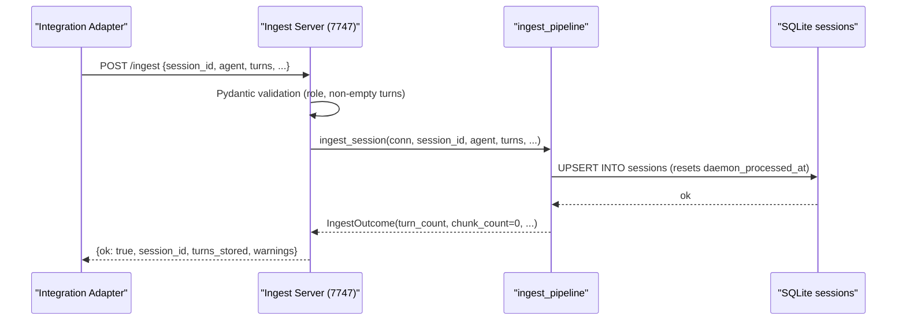
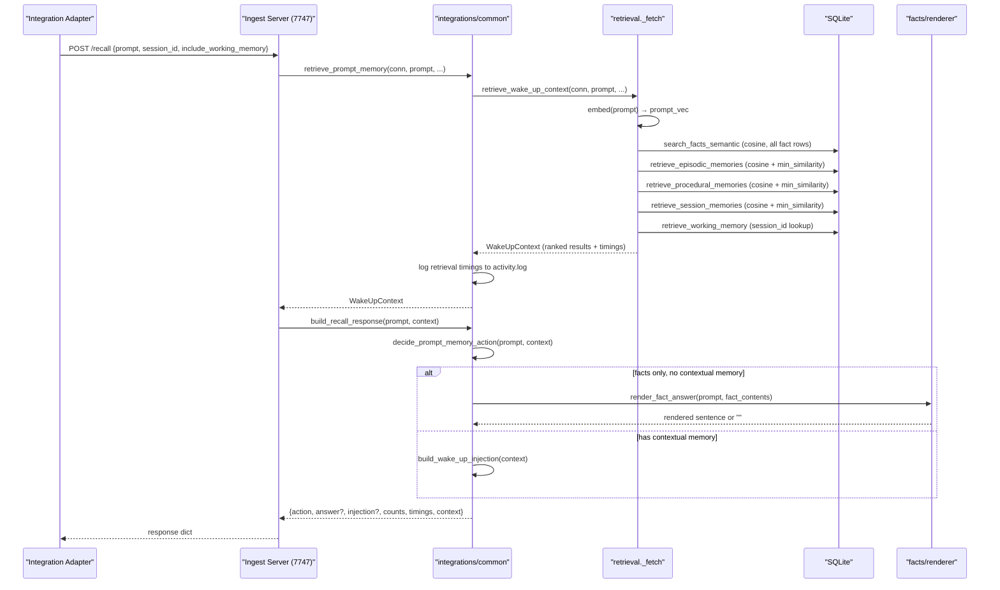
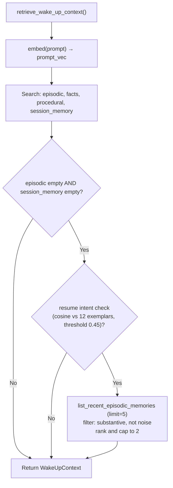
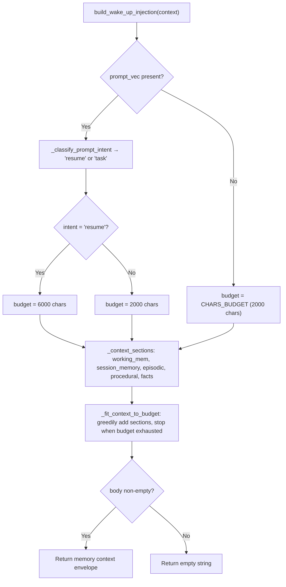
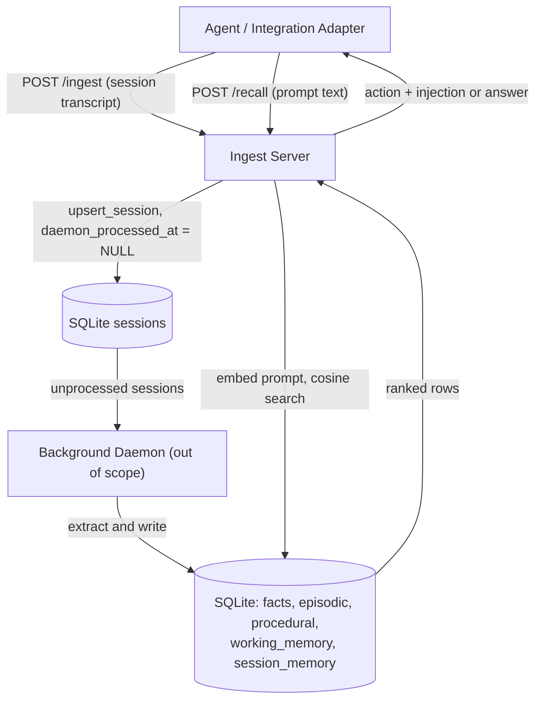

# Ingest and Recall Unit

## 1. Summary

This unit documents the ingest and recall subsystem of agentic-memory: the HTTP server that
accepts session transcripts and answers memory queries, the Python client that wraps those
calls, and the retrieval pipeline that assembles ranked memory context for each new user
prompt.

The ingest side stores session transcripts durably in SQLite so the background daemon can
extract structured memories from them later. The recall side embeds the incoming prompt,
searches every memory type simultaneously, ranks the results, and either answers the prompt
directly from stored facts or injects a condensed memory block into the agent's context window.

Cross-cutting concerns — deployment as a macOS launchd service, the SQLite schema, and the
daemon extraction pipeline — are covered in the overview document. One-line references appear
where those topics surface here.

---

## 2. Surface Overview

| Type | Item | Source | Purpose |
|------|------|--------|---------|
| HTTP endpoint | `GET /status` | `memory/servers/ingest_server.py:199` | Health check; reports DB state and embedding model readiness |
| HTTP endpoint | `POST /ingest` | `memory/servers/ingest_server.py:260` | Persist a session transcript to SQLite |
| HTTP endpoint | `POST /recall` | `memory/servers/ingest_server.py:211` | Retrieve ranked memory context for one prompt |
| Python class | `MemoryClient` | `memory/servers/client.py:10` | Stdlib-only HTTP client; wraps all three endpoints |
| Python function | `ingest_session()` | `memory/servers/ingest_pipeline.py:34` | Core ingest step: upsert session row, return `IngestOutcome` |
| Python function | `retrieve_prompt_memory()` | `integrations/common.py:92` | Retrieval seam shared by all integration adapters |
| Python function | `build_recall_response()` | `integrations/common.py:140` | Serialize a recall decision to the wire dict |
| Python function | `decide_prompt_memory_action()` | `integrations/common.py:125` | Decide between direct answer, injection, or noop |
| Python function | `retrieve_wake_up_context()` | `memory/retrieval/_fetch.py:127` | Embed prompt, search all memory types, return `WakeUpContext` |
| Python function | `build_wake_up_injection()` | `memory/retrieval/_format.py:138` | Format ranked context into a token-budgeted injection string |
| Python function | `render_fact_answer()` | `memory/facts/renderer.py:168` | Deterministic (no LLM) fact-to-answer renderer |
| Python function | `save_session_to_memory()` | `integrations/common.py:70` | Thin wrapper; delegates to `ingest_session()` for Pi and Claude adapters |
| Python function | `open_memory_db_for_ingest()` | `integrations/common.py:53` | Open or bootstrap the SQLite DB for write operations |
| Python function | `open_existing_memory_db()` | `integrations/common.py:63` | Open the SQLite DB only if it already exists (returns `None` otherwise) |

---

## 3. Detailed Documentation

### 3.1 GET /status

**Purpose.** Lightweight health probe for launchd monitors and operator checks.

**Request.** No body, no query parameters.

**Response.** JSON object with the following fields:

| Field | Type | Description |
|-------|------|-------------|
| `status` | `"ok"` | Always `"ok"` while the process is alive |
| `db_path` | string | Absolute path to the SQLite file (default `~/.memory/memory.db`) |
| `db_exists` | bool | Whether the file exists on disk |
| `embed_model_ready` | bool | Whether the embedding model loaded without error at startup |
| `embed_model_name` | string | Model name as reported by `memory/vectors` |
| `embed_model_error` | string | Error message if the embedding model failed to load; empty otherwise |

Source: `memory/servers/ingest_server.py:199–208`.

**Status codes.** `200 OK` always (the endpoint itself cannot fail).

**Authentication.** None. The server binds to `127.0.0.1` only (`memory/servers/ingest_server.py:309`), so network-level isolation is the only access control. `[confirm]` — whether this is intentional for all deployment scenarios.

---

### 3.2 POST /ingest

**Purpose.** Persist a complete session transcript so the background daemon can later extract
structured memories (facts, episodes, procedures, working memory, session memory) from it.

**Request body.** `application/json`, validated by Pydantic `IngestRequest`
(`memory/servers/ingest_server.py:177`):

| Field | Type | Required | Default | Validation |
|-------|------|----------|---------|------------|
| `session_id` | string | yes | — | Non-empty string |
| `agent` | string | no | `"unknown"` | Free text |
| `turns` | array of `Turn` | yes | — | Must not be empty; each turn has `role` and `content` |
| `started_at` | string \| null | no | Server UTC timestamp | ISO 8601 string |
| `metadata` | object \| null | no | `null` | Free JSON object |

`Turn.role` must be `"user"` or `"assistant"` — any other value returns `422 Unprocessable Entity`
(`memory/servers/ingest_server.py:169–173`).

**Response.** `200 OK` on success:

```json
{
  "ok": true,
  "session_id": "<id>",
  "turns_stored": 2,
  "warnings": []
}
```

**Processing.** Delegates to `ingest_session()` (see §3.5). The session row is upserted — a
second call with the same `session_id` overwrites the transcript and resets `daemon_processed_at`
to NULL, which causes the daemon to reprocess the session
(`memory/db/sessions.py:28–31`).

**Logging.** A summarized request and response line are appended to `~/.memory/ingest.log`
unless the `MEMORY_DISABLE_FILE_LOGS=1` environment variable is set or the process is running
under pytest (`memory/servers/ingest_server.py:61–68`).

**Status codes.**

| Code | Condition |
|------|-----------|
| `200 OK` | Session stored successfully |
| `422 Unprocessable Entity` | Pydantic validation failed (e.g., invalid role, empty turns) |
| `500 Internal Server Error` | Unexpected exception; error logged to `memory/utils/logger` |

---

### 3.3 POST /recall

**Purpose.** Given a user prompt, retrieve ranked memory context and decide whether to answer
directly or inject a memory block.

**Request body.** `application/json`, validated by Pydantic `RecallRequest`
(`memory/servers/ingest_server.py:192`):

| Field | Type | Required | Default | Description |
|-------|------|----------|---------|-------------|
| `prompt` | string | yes | — | The user's incoming prompt text |
| `include_working_memory` | bool | no | `false` | If true, fetch working memory for the given `session_id` |
| `session_id` | string \| null | no | `null` | Current session ID; used to scope working memory and exclude it from session-memory results |
| `agent` | string \| null | no | `null` | Caller identity; used only for activity logging |

An empty or whitespace-only `prompt` returns `{"action": "noop"}` immediately without any
database access (`memory/servers/ingest_server.py:214–215`).

**Response.** `200 OK` always on non-empty prompts:

```json
{
  "action": "answer" | "inject" | "noop",
  "facts_count": 1,
  "episodic_count": 0,
  "procedural_count": 0,
  "session_memory_count": 0,
  "working_memory_count": 0,
  "warnings": [],
  "timings": {
    "prompt_embedding_ms": 12.5,
    "memory_search_ms": 45.2,
    "retrieval_total_ms": 57.7
  },
  "context": {
    "facts": [...],
    "episodic": [...],
    "procedural": [...],
    "session_memory": [...],
    "working_mem": null
  },
  "answer": "Your name is Yash.",
  "injection": "[Memory context: ...]"
}
```

`answer` and `injection` are omitted when not applicable. Only one of the two is ever present
(`integrations/common.py:160–163`).

**Action semantics.**

| Action | Condition | Caller behavior |
|--------|-----------|-----------------|
| `answer` | Facts retrieved, no contextual memory (episodes/procedures/session memory), rendered answer non-empty | Integration hook returns the answer directly without LLM call |
| `inject` | Any contextual memory retrieved, or facts with contextual memory | Integration hook prepends the injection string to the prompt |
| `noop` | No memory retrieved, or prompt is blank | Integration hook passes the prompt through unchanged |

**Status codes.**

| Code | Condition |
|------|-----------|
| `200 OK` | Retrieval completed (including zero-result case) |
| `500 Internal Server Error` | Unexpected exception; error logged |

---

### 3.4 MemoryClient

**Source.** `memory/servers/client.py`

A pure stdlib HTTP client (uses `urllib.request`; no third-party dependencies). Intended for
integration adapters and CLI commands that must avoid import weight.

**Constructor.**

```python
MemoryClient(host: str = "localhost", port: int = 7747)
```

**Methods.**

| Method | Maps to | Returns |
|--------|---------|---------|
| `save_session(session_id, agent, turns, started_at, metadata)` | `POST /ingest` | `dict` |
| `recall(prompt, *, include_working_memory, session_id, agent)` | `POST /recall` | `dict` |
| `status()` | `GET /status` | `dict` |

**Error contract.**

- `ConnectionError` — server not reachable (`urllib.error.URLError`). Message includes the
  start command: `python3 memory/servers/ingest_server.py`
  (`memory/servers/client.py:51`).
- `RuntimeError` — server returned an HTTP error. Message includes the status code and the
  `detail` field from the JSON body when present (`memory/servers/client.py:17–31`).

---

### 3.5 ingest_session()

**Source.** `memory/servers/ingest_pipeline.py:34`

```python
def ingest_session(conn, *, session_id, agent, turns, started_at, updated_at,
                   metadata=None, embed_fn=embed_text) -> IngestOutcome
```

The `embed_fn` parameter is accepted for API compatibility but is immediately discarded
(`memory/servers/ingest_pipeline.py:51`). No embeddings are computed at ingest time; the
embedding model warm-up in the server lifespan exists to pre-load the model for recall, not
ingest.

**What it does.**
1. Calls `upsert_session()` to insert or replace the session row in SQLite.
2. Returns `IngestOutcome(session_id, turn_count=len(turns), chunk_count=0, embedding_stored=False, warnings=[])`.

**IngestOutcome fields.**

| Field | Value | Meaning |
|-------|-------|---------|
| `session_id` | echoed | Identity of stored session |
| `turn_count` | `len(turns)` | Number of turns stored |
| `chunk_count` | always `0` | Chunk side-table removed; legacy field retained for callers |
| `embedding_stored` | always `false` | Embeddings computed at daemon time, not ingest time |
| `warnings` | always `[]` | No partial failure paths in current implementation |

---

### 3.6 retrieve_prompt_memory()

**Source.** `integrations/common.py:92`

```python
def retrieve_prompt_memory(conn, prompt, *, include_working_memory, session_id=None,
                           embed_fn=None) -> WakeUpContext
```

The shared retrieval seam used by the HTTP server, the Claude hook, and the Pi adapter.
Calls `retrieve_wake_up_context()` and then writes timing data to the activity log
(`integrations/common.py:106–121`).

**Logged fields.**

```
retrieval.recall_timing: session, prompt_chars, include_working_memory,
  prompt_embedding_ms, memory_search_ms, retrieval_total_ms,
  facts_count, episodic_count, procedural_count, session_memory_count,
  working_memory_count, warnings_count
```

---

### 3.7 decide_prompt_memory_action()

**Source.** `integrations/common.py:125`

```python
def decide_prompt_memory_action(prompt, context) -> RecallOutcome
```

The routing decision that determines which action the caller takes:

```
if facts present AND no contextual memory (working_mem, episodic, procedural, session_memory):
    answer = render_fact_answer(prompt, fact_contents)
    if answer:
        return RecallOutcome(context, answer=answer)   → action == "answer"
    return RecallOutcome(context)                       → action == "noop"

else:
    injection = build_wake_up_injection(context)
    return RecallOutcome(context, injection=injection)  → action == "inject" or "noop"
```

Source: `integrations/common.py:127–137`.

A `RecallOutcome.action` is computed as a property: `"answer"` if `answer` is truthy, `"inject"`
if `injection` is truthy, `"noop"` otherwise (`integrations/common.py:36–39`).

---

### 3.8 retrieve_wake_up_context()

**Source.** `memory/retrieval/_fetch.py:127`

```python
def retrieve_wake_up_context(conn, prompt, *, include_working_memory,
                              session_id=None, embed_fn=embed_text) -> WakeUpContext
```

**Processing steps.**

1. **Embed prompt.** `embed_fn(prompt)` produces a 384-dimensional float vector. Timing is
   measured and stored in the returned `WakeUpContext.timings`
   (`memory/retrieval/_fetch.py:143–144`).

2. **Fetch working memory.** The actual gate is `session_id`. The expression
   `session_id if (include_working_memory or session_id) else None` evaluates to `None`
   whenever `session_id` is `None`, regardless of `include_working_memory`; and to
   `session_id` whenever `session_id` is set, regardless of the flag. In practice,
   working memory is retrieved if and only if `session_id` is provided. The
   `include_working_memory` flag has no discriminating effect in the current implementation
   (`memory/retrieval/_fetch.py:147–150`). `[confirm]` — whether this is intentional.

3. **Fetch episodic memories.** `retrieve_episodic_memories()` with
   `min_similarity=0.58`, `limit=8`. Results are then ranked and capped to 2
   (`memory/retrieval/_fetch.py:152`, `memory/retrieval/_models.py:12–13`).

4. **Fetch facts.** `search_facts_semantic()` with `limit=5`. Filtered by
   `min_similarity=0.38`, then ranked and capped to 3
   (`memory/retrieval/_fetch.py:153`, `memory/retrieval/_models.py:15–17`).

5. **Fetch procedural memories.** `retrieve_procedural_memories()` with
   `min_similarity=0.58`, `limit=4`, capped to 2 after ranking
   (`memory/retrieval/_fetch.py:154`, `memory/retrieval/_models.py:19–21`).

6. **Fetch session memories.** `retrieve_session_memories()` with
   `min_similarity=0.60`, `limit=4`, capped to 2 after ranking. The current `session_id`
   is excluded to prevent self-referential matches
   (`memory/retrieval/_fetch.py:155–160`, `memory/retrieval/_models.py:22–24`).

7. **Resume-intent fallback.** If both episodic and session-memory results are empty, and the
   prompt's embedding matches any of the 12 resume-intent exemplars at cosine similarity ≥
   0.45 (`memory/retrieval/_intent.py:20–21`), then recent episodic memories are fetched
   by recency (up to 5), filtered to substantive episodes (≥2 details, no "missing memory"
   markers), and ranked (`memory/retrieval/_fetch.py:162–163`).

8. **Return `WakeUpContext`.** All results plus per-stage warnings and timing dict.

**WakeUpContext fields.**

| Field | Type | Description |
|-------|------|-------------|
| `cache_hit` | `MemoryRow \| None` | Always `None` in current implementation |
| `working_mem` | `MemoryRow \| None` | Working-memory snapshot for the session |
| `enrichment` | `list[MemoryRow]` | Always `[]` in current implementation |
| `episodic` | `list[MemoryRow]` | Up to 2 ranked episodic memories |
| `facts` | `list[MemoryRow]` | Up to 3 ranked facts |
| `procedural` | `list[MemoryRow]` | Up to 2 ranked procedural memories |
| `session_memory` | `list[MemoryRow]` | Up to 2 ranked session-memory entries |
| `warnings` | `list[RetrievalWarning]` | Non-fatal per-stage errors |
| `prompt_vec` | `list[float] \| None` | Prompt embedding, forwarded to formatter for budget selection |
| `timings` | `dict[str, float]` | `prompt_embedding_ms`, `memory_search_ms`, `retrieval_total_ms` |

Source: `memory/retrieval/_models.py:35–48`.

---

### 3.9 build_wake_up_injection()

**Source.** `memory/retrieval/_format.py:138`

```python
def build_wake_up_injection(context: WakeUpContext) -> str
```

Assembles the injection string that is prepended to the agent's next prompt turn.

**Budget selection.** If `context.prompt_vec` is set, the prompt's intent is classified as
`"resume"` or `"task"` by comparing against the 12 exemplar embeddings
(`memory/retrieval/_intent.py:58–66`). Budget is then:

| Intent | Characters | Approximate tokens |
|--------|------------|-------------------|
| `task` | 2000 | ~500 |
| `resume` | 6000 | ~1500 |

Fallback when `prompt_vec` is None: `CHARS_BUDGET = 2000` chars
(`memory/retrieval/_models.py:8–9`).

**Section order.** Sections are assembled in priority order and the budget is respected
greedily — each section is included whole or not at all
(`memory/retrieval/_format.py:105–112`, `_fit_context_to_budget`):

1. Working memory
2. Session memory
3. Episodic memory
4. Procedural memory
5. Facts

**Output envelope.**

```
[Memory context: <body>]
```

Returns an empty string when no content survives budget fitting
(`memory/retrieval/_format.py:150–152`).

---

### 3.10 render_fact_answer()

**Source.** `memory/facts/renderer.py:168`

```python
def render_fact_answer(user_prompt: str, fact_contents: list[str]) -> str
```

A deterministic, LLM-free renderer. Parses canonical fact strings of the form
`entity.attribute = value` (`memory/facts/renderer.py:15`), scores each against the prompt
using token overlap and attribute aliases, and renders matching facts as natural-language
sentences.

**Match scoring.**

The scorer looks for prompt tokens that overlap with the fact's attribute name and a set of
predefined aliases (`memory/facts/renderer.py:17–27`, `96–117`). An extra point is awarded
when the entity is `user` and the prompt contains first-person pronouns (`i`, `me`, `my`).
Only facts with a non-zero score are rendered.

**Rendering templates** (for `entity == "user"`) (`memory/facts/renderer.py:122–136`):

| Attribute | Rendered sentence |
|-----------|------------------|
| `name` | `Your name is {value}.` |
| `location` | `You live in {value}.` |
| `company` | `You work at {value}.` |
| `role` | `Your role is {value}.` |
| `timezone` | `Your timezone is {value}.` |
| `editor` | `Your editor is {value}.` |
| `shell` | `Your shell is {value}.` |
| `favorite_language` | `Your favorite language is {value}.` |
| `preferred_language` | `Your preferred language is {value}.` |
| `response_style` | `Your preferred response style is {value}.` |
| *(other)* | `Your {humanized attribute} is {value}.` |

**Output length.** Capped at `MEMORY_FACT_RENDER_MAX_CHARS` (default 240, env-overridable)
(`memory/facts/renderer.py:14`). Returns an empty string when no facts match the prompt.

---

## 4. Flow Diagrams

### 4.1 POST /ingest — end-to-end

The following diagram shows the ingest path from HTTP request to committed session row.



---

### 4.2 POST /recall — retrieval and decision

The following diagram shows the recall path from HTTP request to action response.



---

### 4.3 Resume-intent fallback in retrieval

The following diagram shows the additional path taken when a prompt signals a session-resume
intent and no episodic or session-memory results were found.



---

### 4.4 build_wake_up_injection — budget fitting

The following diagram shows how the injection string is assembled and trimmed to budget.



---

## 5. Business Rules

| Rule | Business Meaning | Implementation | Source |
|------|-----------------|----------------|--------|
| Turn roles must be `"user"` or `"assistant"` | Only standard conversation turns are stored; system, tool, and other roles are rejected | Pydantic `field_validator` raises `ValueError` for any other value | `memory/servers/ingest_server.py:169–173` |
| Re-ingesting a session resets daemon processing | Updated sessions are re-extracted by the daemon so stale memories are replaced | `upsert_session` sets `daemon_processed_at = NULL` on conflict | `memory/db/sessions.py:28–31` |
| Empty prompt short-circuits recall | A blank prompt cannot produce useful memory context; the caller receives `noop` immediately | `if not prompt: return {"action": "noop"}` | `memory/servers/ingest_server.py:214–215` |
| Facts-only path returns a direct answer (no LLM) | When only facts match and no richer context exists, the system can answer without an Ollama call | `decide_prompt_memory_action` routes to `render_fact_answer` only when `working_mem`, `episodic`, `procedural`, and `session_memory` are all empty | `integrations/common.py:127–137` |
| Cosine similarity thresholds gate per-type results | Low-relevance memories must not pollute the context window | Threshold constants: episodic 0.58, facts 0.38, procedural 0.58, session_memory 0.60 | `memory/retrieval/_models.py:11–24` |
| "Missing memory" episodes are demoted and excluded | Episodes that record "I have no information about X" are noise, not signal | Score penalty −0.25; also excluded from recent-episode fallback | `memory/retrieval/_rank.py:22–33`, `_row_score:73–74` |
| Resume prompts get a larger context budget | A session-handoff query needs the full prior context; a task query needs only a snippet | Budget expands from 2000 to 6000 chars when intent classifier returns `"resume"` | `memory/retrieval/_intent.py:23–26`, `_format.py:143–148` |
| Current session is excluded from session-memory results | A session must not retrieve its own handoff record | `exclude_session_id` parameter passed to `retrieve_session_memories` | `memory/retrieval/_fetch.py:120` |
| Working memory is retrieved only when `session_id` is known | Without a session ID there is no scope for a working-memory lookup | `_retrieve_working_memory` returns `None` immediately when `session_id` is falsy | `memory/retrieval/_fetch.py:93–94` |
| Fact answer is capped at 240 characters | Answers stay concise enough not to be disruptive in the agent's reply | `MEMORY_FACT_RENDER_MAX_CHARS` (default 240, env-overridable) | `memory/facts/renderer.py:14` |

---

## 6. Dependencies

### 6.1 SQLite (`~/.memory/memory.db`)

Every request that touches retrieval or ingest opens a fresh connection and closes it in a
`finally` block (`memory/servers/ingest_server.py:265–300`). WAL mode and a 5000 ms busy
timeout allow concurrent readers during daemon writes
(`memory/db/schema.py:88–95`).

**Failure behavior.** A SQLite exception propagates as a `500 Internal Server Error`. There is
no retry or circuit-breaker logic in the server itself.

### 6.2 Embedding model (`all-MiniLM-L6-v2`)

Loaded via `sentence-transformers` at server startup in the lifespan handler
(`memory/servers/ingest_server.py:124–139`). If loading fails, `_EMBED_MODEL_READY` is set
to `false` and the error message is stored in `_EMBED_MODEL_ERROR`; the server continues
running. Recall requests that require embedding will fail at the `embed_fn` call, propagating
as `500`.

**Failure behavior.** No fallback; recall is unavailable if the model cannot be loaded. Ingest
is unaffected (no embedding is computed at ingest time).

### 6.3 CORS origins

Defaults to `https://copilot.microsoft.com,https://github.com`; overridable via
`MEMORY_INGEST_CORS_ORIGINS` (comma-separated list)
(`memory/servers/ingest_server.py:153–162`).

### 6.4 Port

Default `7747`; overridable via `MEMORY_INGEST_PORT`
(`memory/servers/ingest_server.py:35`).

### 6.5 Activity log

`retrieve_prompt_memory()` writes one JSON-line per call to `~/.memory/activity.log`
via `activity_log()` (`integrations/common.py:106–121`). If the log write fails, it is silently
swallowed (`[inferred]` — no explicit error handling visible for `activity_log` in this call
path).

---

## 7. Error Handling

| Failure Scenario | Detection | Server Behavior | Caller Response | Retry |
|-----------------|-----------|-----------------|-----------------|-------|
| Invalid turn role | Pydantic `field_validator` | 422 with validation detail | Client sees `RuntimeError("HTTP 422: ...")` | Fix the payload |
| Empty `turns` list | Pydantic `field_validator` | 422 with validation detail | Client sees `RuntimeError("HTTP 422: ...")` | Fix the payload |
| Empty prompt | `if not prompt` guard | 200 `{"action": "noop"}` | Caller treats as noop | N/A |
| SQLite locked | `busy_timeout = 5000 ms` in SQLite | After 5s, SQLite raises `OperationalError` → 500 | Client sees `RuntimeError("HTTP 500: ...")` | Retry after delay |
| Embedding model not loaded | `_EMBED_MODEL_READY = False` at startup | Model calls raise exception → 500 on recall | Client sees `RuntimeError("HTTP 500: ...")` | Investigate startup logs |
| Per-stage retrieval error | `except Exception` in each `_retrieve_*` helper | Warning appended to `WakeUpContext.warnings`; other stages continue | `warnings` list in response; action may be `noop` | No retry; partial results returned |
| Server not running | `urllib.error.URLError` in client | — | `ConnectionError` with start hint | Start the server |
| Unhandled exception | `except Exception` in endpoint | 500; logged to `error_log` and `ingest.log` | Client sees `RuntimeError("HTTP 500: ...")` | Investigate logs |

Per-stage retrieval errors (episodic, facts, procedural, session memory, working memory) are
non-fatal. Each retrieval helper wraps its call in `try/except` and appends a
`RetrievalWarning` rather than propagating the exception
(`memory/retrieval/_fetch.py:41–99`). The `warnings` list is always present in the
`/recall` response even when empty.

---

## 8. Data Flow

The following diagram shows how data moves between the ingest path, the daemon extraction
pipeline, and the recall path.



---

## 9. Known Gaps

| Item | Status | Notes |
|------|--------|-------|
| `cache_hit` field in `WakeUpContext` | `[unknown]` | Always `None` in the current implementation (`memory/retrieval/_fetch.py:169`). The field exists in the dataclass but is never populated. |
| `enrichment` field in `WakeUpContext` | `[unknown]` | Always `[]` in the current implementation (`memory/retrieval/_fetch.py:170`). Purpose not determinable from code. |
| `embed_fn` parameter in `ingest_session()` | `[unknown]` | Parameter is declared and accepted for API compatibility but immediately deleted (`memory/servers/ingest_pipeline.py:51`). No caller passes it. Whether it will ever be used is `[confirm]`. |
| CORS origin policy | `[confirm]` | Defaults to `copilot.microsoft.com` and `github.com`. Whether this matches all intended deployment targets needs operator confirmation. |
| Server binds only to `127.0.0.1` | `[confirm]` | Confirmed at `memory/servers/ingest_server.py:309`. This is the only access control. Whether this is intentional for all environments needs confirmation. |
| `semantic_search` in `memory/db/sessions.py` | `[unknown]` | Computes per-session embeddings on the fly by embedding the full transcript text (`memory/db/sessions.py:60–72`). Not called from the recall path — only from the CLI `semantic` command. No per-session embedding column is stored. |
| `search_facts_semantic` loads all fact rows into memory | `[inferred]` | The Python implementation scans every row with a stored embedding (`memory/db/facts.py:213`). For a large fact store this will grow in memory and latency. No pagination or approximate nearest-neighbour index is present. |
| Activity log write failure handling | `[inferred]` | `activity_log()` in `integrations/common.py:106` has no visible error handling in this call site. Silent failure is assumed. |

---

## 10. Provenance

Generated from `agentic-memory` @ `7df34ac` (`refactor-integrations-pi-claude-memory`) on 2026-09-18. Regenerate rather than hand-edit.
