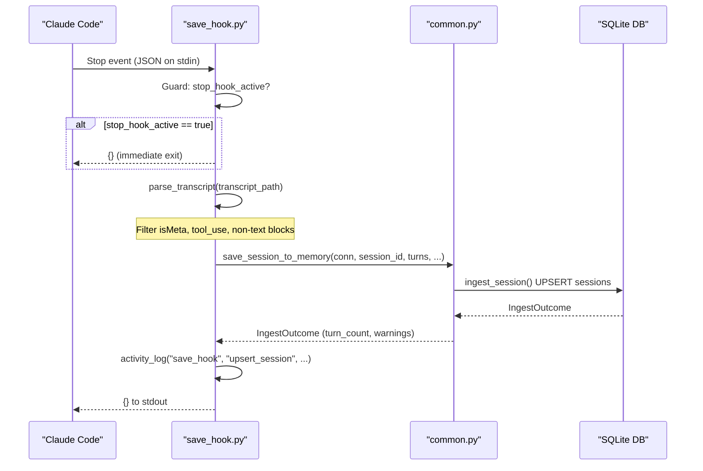
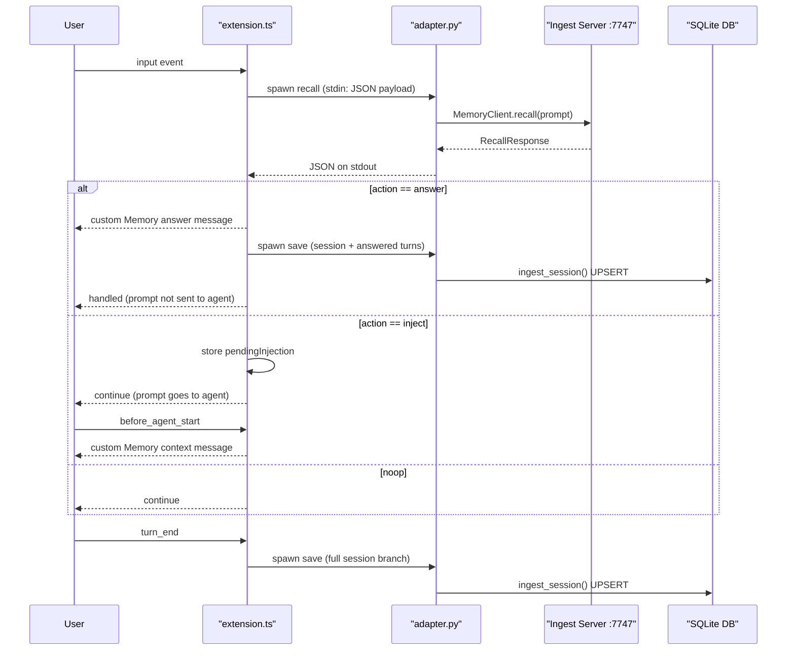
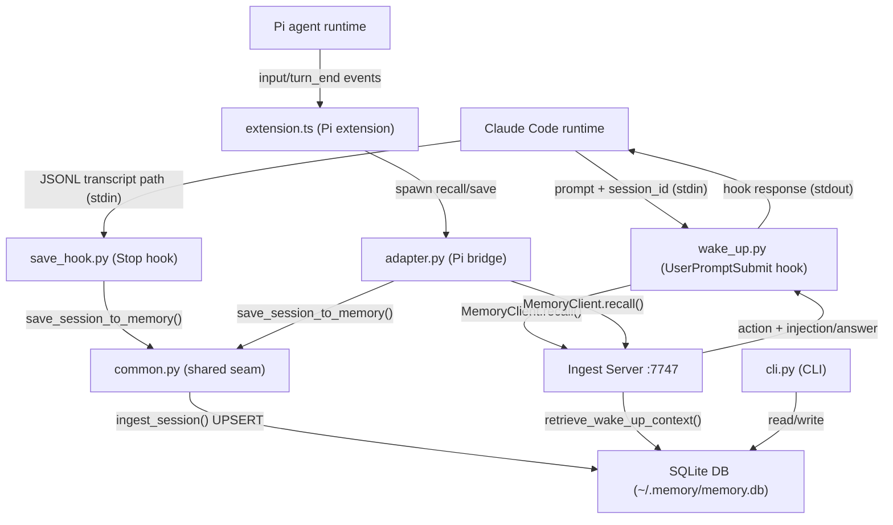

# Integrations and CLI — `integrations-cli`

## 1. Summary

This unit covers how agentic-memory connects to two agent runtimes (Claude Code and Pi) and how
operators interact with the memory database from the command line. The Claude Code integration
consists of two hooks that Claude Code invokes automatically: a `Stop` hook (`save_hook.py`)
that captures every conversation transcript when it ends, and a `UserPromptSubmit` hook
(`wake_up.py`) that retrieves memory context at the start of every prompt and either answers
directly or enriches the prompt with what was found. The Pi integration mirrors this pattern
through a TypeScript extension (`extension.ts`) backed by a Python subprocess bridge
(`adapter.py`). All four integration adapters share a single policy seam (`integrations/common.py`)
that keeps save and recall logic identical across agent runtimes. The CLI (`cli.py`) exposes
nine commands for bootstrapping, inspecting, searching, and manually managing the database, while
`install.sh` wires everything into `~/.claude/settings.json`, the Pi extension directory, and four
macOS launchd services.

Cross-cutting concerns — storage schema, ingest pipeline, recall server implementation, daemon
extraction, and the dashboard server — are covered in the overview document.

---

## 2. Surface Overview

| Kind | Item | File | Purpose |
|---|---|---|---|
| Claude Code hook | `Stop` | `integrations/claude/save_hook.py` | Parse JSONL transcript; upsert session to DB |
| Claude Code hook | `UserPromptSubmit` | `integrations/claude/wake_up.py` | Retrieve memory; inject context or answer directly |
| Pi extension | TypeScript extension | `integrations/pi/extension.ts` | Intercept Pi agent prompts; recall and save via subprocess |
| Pi bridge | Python adapter | `integrations/pi/adapter.py` | stdin/stdout JSON bridge called by the extension |
| Shared seam | Save/recall policy | `integrations/common.py` | Canonical save and recall logic for all integrations |
| CLI | `bootstrap` | `cli.py` | Create the SQLite schema at `~/.memory/memory.db` |
| CLI | `status` | `cli.py` | Print row counts for all memory tables |
| CLI | `search` | `cli.py` | Full-text search over session transcripts |
| CLI | `semantic` | `cli.py` | Cosine-similarity search over session embeddings |
| CLI | `get-session` | `cli.py` | Dump one session as JSON |
| CLI | `tail` | `cli.py` | Print the N most recent sessions |
| CLI | `add-fact` | `cli.py` | Insert a manual fact |
| CLI | `delete-fact` | `cli.py` | Delete a fact by ID |
| CLI | `dashboard` | `cli.py` | Open the dashboard in a browser |
| Installer | `install.sh` | `install.sh` | Wire hooks, extension, and launchd services |

---

## 3. Detailed Documentation

### 3.1 Claude Code `Stop` hook — `integrations/claude/save_hook.py`

**Purpose.** Claude Code calls this script after every assistant response. It reads the session
transcript written to disk by Claude Code, filters it to user-visible turns only, and upserts the
result to the SQLite memory database.

**Invocation.** Claude Code invokes the hook as a shell command with no arguments. The hook reads
a JSON payload from stdin. `install.sh` registers it in `~/.claude/settings.json` under the `Stop`
event with `matcher: ""` (fires on every session, regardless of context) (`install.sh:238-242`).

**Stdin payload fields**

| Field | Type | Meaning |
|---|---|---|
| `transcript_path` | string | Absolute path to the JSONL transcript written by Claude Code |
| `session_id` | string | Fallback session ID if none is found in the JSONL itself |
| `stop_hook_active` | bool | Guard flag — true when Claude Code is already processing a Stop hook |

**Stdout.** Always `{}` on success. Claude Code requires a JSON object on stdout from every hook.

**Exit codes.** Exits 0 on success and on all caught exceptions — the hook never returns a
non-zero code, so errors are written to the log but do not block Claude Code (`save_hook.py:216-219`).

**Transcript parsing (`parse_transcript`).** The function reads each line of the JSONL file and
applies the following filters (`save_hook.py:73-137`):

- Lines with `type == "user"` and `isMeta == True` are skipped (system/tool events).
- Lines with `type == "assistant"` and `stop_reason == "tool_use"` are skipped (intermediate
  tool-call preambles; only the final reply is kept) (`save_hook.py:121-126`).
- Content is extracted from either a plain string or a list of typed blocks. Only blocks with
  `type == "text"` contribute; `thinking` blocks and `tool_result` blocks are excluded.
- Multiple text blocks within one turn are joined with `\n`.
- The `started_at` timestamp is taken from the first retained turn's `timestamp` field.
- The `session_id` is taken from the first line that carries a `sessionId` field; the payload's
  `session_id` is used as a fallback (`save_hook.py:103-107`, `save_hook.py:154-160`).

**Recursion guard.** If the payload's `stop_hook_active` field is true, the hook prints `{}`
immediately and exits — this prevents a hook-triggered Claude Code response from firing another
Stop event that would loop (`save_hook.py:210-212`).

**Agent name.** Defaults to `"claude"`, overridable via the `MEMORY_AGENT_NAME` environment
variable (`save_hook.py:179`).

**Dry-run mode.** Pass `--dry-run` as a CLI argument; the hook prints what it would save (session
ID, timestamps, first four turns) without writing to the database (`save_hook.py:167-176`).

**Logging.** Writes to stderr and to `~/.memory/save_hook.log`. File logging is suppressed when
`MEMORY_DISABLE_FILE_LOGS=1` or when running inside pytest (`save_hook.py:41-47`).

**Side effects.** Writes one row to the `sessions` table (upsert — a second save for the same
session ID replaces the row rather than creating a duplicate; confirmed by
`tests/test_save_hook.py:262-273`). Does not trigger extraction; the background daemon picks
up the new session on its next poll.

---

### 3.2 Claude Code `UserPromptSubmit` hook — `integrations/claude/wake_up.py`

**Purpose.** Claude Code calls this script before every user prompt. The hook retrieves memory
context for the prompt and either answers the question directly from stored facts (blocking the
original prompt) or prepends a memory injection to the prompt (enriching it), or does nothing.

**Invocation.** Invoked by Claude Code as a shell command before the prompt is processed. Reads
a JSON payload from stdin. `install.sh` registers it in `~/.claude/settings.json` under the
`UserPromptSubmit` event (`install.sh:243-247`).

**Stdin payload fields**

| Field | Type | Meaning |
|---|---|---|
| `session_id` | string | Claude Code session identifier (sanitized to `[a-zA-Z0-9_-]` by the hook) |
| `prompt` | string | The user's raw prompt text |

**Prompt preprocessing.** Before retrieval, the hook strips XML tags from the prompt
(`wake_up.py:117-119`) — this removes injected system blocks such as `<SYSTEM_REMINDER>` that
Claude Code prepends to prompts, ensuring the retrieval query contains only the user's own words.
The session ID is sanitized to replace non-alphanumeric characters with `_`
(`wake_up.py:113-114`).

**First-message detection.** A flag file is created at `/tmp/memory_first_msg_{session_id}` on
the first invocation for a given session and checked on all subsequent ones
(`wake_up.py:97-110`). The first prompt includes working memory in the recall request
(`include_working_memory=True`); all later prompts do not (`include_working_memory=False`).
This is confirmed by `tests/test_wake_up.py:234-244`.

**Recall.** The hook calls `MemoryClient.recall()` against the ingest server on port 7747
(`wake_up.py:150-162`). If the server is unreachable (connection error or runtime error), the
hook emits `{}` and allows the prompt through unchanged. There is no local retrieval fallback.

**Decisions and stdout payloads**

| Server `action` | Hook stdout | Effect on Claude Code |
|---|---|---|
| `"answer"` | `{"decision":"block","reason":"<answer>","suppressOriginalPrompt":true}` | Prompt is blocked; Claude Code displays the answer directly |
| `"inject"` | `{"hookSpecificOutput":{"hookEventName":"UserPromptSubmit","additionalContext":"<injection>"}}` | Injection prepended to the prompt as additional context |
| `"noop"` | `{}` | Prompt proceeds unchanged |

Confirmed by `tests/test_wake_up.py:88-92` (noop), `tests/test_wake_up.py:96-126` (answer),
`tests/test_wake_up.py:129-158` (inject).

**Logging.** Writes to `~/.memory/wake_up.log`. Every invocation logs the prompt, the server
response action, fact lookup results, and (for injections) the effective combined prompt that
Claude Code will see. File logging is suppressed when `MEMORY_DISABLE_FILE_LOGS=1` or in pytest
(`wake_up.py:45-50`).

**Retrieval metrics.** After each call, the hook writes to the `retrievals` table via
`log_retrieval()` and writes a structured line to the activity log via `activity_log()`, recording
turn type, fact/episode/procedure/session-memory counts, and an estimated token count
(`wake_up.py:239-263`). The token estimate is `len(payload_text) // 4`.

**Exit codes.** Always exits 0. All exceptions are caught and logged; parse failures cause the
hook to emit `{}` and allow through (`wake_up.py:273-276`).

---

### 3.3 Pi TypeScript extension — `integrations/pi/extension.ts`

**Purpose.** Registers with the Pi agent runtime to intercept user prompts, retrieve memory
context, display it as a custom message in the Pi UI, and save completed turns to the memory
database.

**Entry point.** The default export `agenticMemoryExtension(pi: ExtensionAPI)` is loaded by the
Pi runtime from the wrapper file `~/.pi/agent/extensions/agentic-memory.ts` placed by
`install.sh` (`install.sh:260-264`). A singleton guard prevents duplicate registration if the
runtime loads the module more than once (`extension.ts:122-127`).

**Python bridge.** All database and server calls are delegated to `adapter.py` via a spawned
subprocess. The function `callAdapter(command, payload, signal?)` writes the payload as JSON to
the child's stdin and reads the JSON response from its stdout (`extension.ts:83-119`). The Python
binary is `process.env.MEMORY_PYTHON ?? "python3"` (`extension.ts:9`). An `AbortSignal` can be
passed to cancel the subprocess with `SIGTERM`.

**Registered command.** `memory-status` — a Pi slash command that probes the adapter with an
empty recall and reports loaded/error status in the Pi UI (`extension.ts:131-141`).

**Message renderer.** Registers a renderer for messages with `customType: "agentic-memory"`.
Answers are labelled `[Memory answer]`; injected context is labelled `[Memory context]`
(`extension.ts:143-149`).

**`input` event handler.** Fires on every user input before the agent processes it
(`extension.ts:151-195`). Behavior:

1. Calls `adapter.py recall` with the prompt and `include_working_memory: false`. [confirm]
   Working memory is never requested from Pi regardless of first-message status.
2. If `action == "answer"`: sends a `[Memory answer]` custom message to the Pi UI, immediately
   saves the session (including the memory-answered turn pair as extra turns), and returns
   `{ action: "handled" }` — the prompt does not reach the agent.
3. If `action == "inject"`: stores `{ prompt, injection }` in `pendingInjection` and returns
   `{ action: "continue" }` — the prompt proceeds to the agent.
4. If `action == "noop"` or on error: returns `{ action: "continue" }`.

**`before_agent_start` event handler.** Fires immediately before the Pi agent begins processing
the prompt (`extension.ts:197-209`). If `pendingInjection` is set and its `prompt` matches the
current event's prompt, the injection is passed to the agent as a custom message and
`pendingInjection` is cleared.

**`turn_end` event handler.** After each agent turn, saves the full session branch via
`adapter.py save` (`extension.ts:211-219`). Session turns are built from
`ctx.sessionManager.getBranch()`, skipping entries that are not `message` type and skipping
assistant messages with `stopReason == "toolUse"` (`extension.ts:36-62`).

**Session metadata.** The save payload includes `integration: "pi"`, the working directory
(`ctx.cwd`), and the session file path (`ctx.sessionManager.getSessionFile()`)
(`extension.ts:76-80`).

---

### 3.4 Pi Python bridge — `integrations/pi/adapter.py`

**Purpose.** Provides a stdin/stdout JSON interface that the TypeScript extension uses to call
Python DB and server code without importing a Python runtime into Node.

**Invocation.**

```
python3 integrations/pi/adapter.py recall   # read JSON from stdin; write RecallResponse to stdout
python3 integrations/pi/adapter.py save     # read JSON from stdin; write SaveResult to stdout
```

Exit codes: 0 on success, 1 on unhandled exception, 2 on unknown or missing command
(`adapter.py:164-187`).

**`recall` command.** Accepts a JSON payload with `prompt`, `session_id`, and
`include_working_memory`. Delegates entirely to `MemoryClient.recall()` against port 7747 —
the `db_path` parameter is accepted for interface compatibility but is immediately deleted and
not used (`adapter.py:119`). On `ConnectionError` or `RuntimeError`, returns
`{"action":"noop","error":"...","server_required":true}` (`adapter.py:155-161`). Confirmed by
`tests/test_pi_adapter.py:11-15`.

**`save` command.** Accepts a JSON payload with `session_id`, `turns`, `agent`, `started_at`,
`updated_at`, and optional `metadata`. Validates that `turns` and `session_id` are non-empty,
then calls `save_session_to_memory()` via `integrations/common.py`. Returns
`{"ok":true,"session_id":"...","turns_stored":N,"warnings":[...]}` on success, or
`{"ok":false,"error":"..."}` on validation failure or exception (`adapter.py:82-115`). Empty
turns return `{"ok":false,"error":"turns must not be empty"}` (`adapter.py:83-86`, confirmed by
`tests/test_pi_adapter.py:76-81`).

**Logging.** Recall events are appended to `~/.memory/wake_up.log`; save events to
`~/.memory/save_hook.log` (`adapter.py:26-27`). Suppressed under `MEMORY_DISABLE_FILE_LOGS=1`
or inside pytest.

---

### 3.5 Shared save/recall seam — `integrations/common.py`

**Purpose.** Centralizes DB-open, save, and recall logic so that all integration adapters behave
identically without duplicating policy.

**`DEFAULT_DB_PATH`** — `os.path.expanduser("~/.memory/memory.db")` (`common.py:20`).

**`open_memory_db_for_ingest(db_path)`** — Creates the `~/.memory/` directory if absent, then
bootstraps the schema if the DB file is missing or empty; otherwise opens the existing file.
Called by `save_hook.py` and `adapter.py` on the save path (`common.py:53-60`).

**`open_existing_memory_db(db_path)`** — Returns `None` if the DB is absent or empty, so
callers can skip retrieval cleanly without crashing (`common.py:63-67`). Confirmed by
`tests/test_integrations_common.py:118-119`.

**`save_session_to_memory(conn, *, session_id, agent, turns, started_at, updated_at, metadata)`**
— Delegates to `ingest_session()` in `memory.servers.ingest_pipeline`; returns an `IngestOutcome`
with `turn_count` and `warnings` (`common.py:70-89`).

**`retrieve_prompt_memory(conn, prompt, *, include_working_memory, session_id, embed_fn)`** —
Delegates to `retrieve_wake_up_context()` in `memory.retrieval`; always writes a
`recall_timing` record to the activity log with embedding latency, search latency, total latency,
and per-type result counts (`common.py:92-122`).

**`decide_prompt_memory_action(prompt, context) → RecallOutcome`** — Applies the answer-vs-inject
decision:

1. If `context.facts` is non-empty **and** none of `working_mem`, `episodic`, `procedural`, or
   `session_memory` is non-empty: call `render_fact_answer(prompt, facts)`. If it returns
   non-empty text, return `RecallOutcome(answer=text)` (action: `"answer"`). If it returns empty,
   return `RecallOutcome()` (action: `"noop"`) (`common.py:130-134`).
2. Otherwise: call `build_wake_up_injection(context)` and return
   `RecallOutcome(injection=injection)` (action: `"inject"` if non-empty, else `"noop"`)
   (`common.py:136-137`).

`RecallOutcome.action` is a computed property (`common.py:33-37`). Confirmed by
`tests/test_integrations_common.py:17-70`.

**`build_recall_response(prompt, context) → dict`** — Serializes one recall decision for HTTP
and adapter callers; used by the ingest server's `/recall` endpoint (out of scope for this unit)
and included here as the canonical serialization contract (`common.py:140-164`).

---

### 3.6 CLI — `cli.py`

**Invocation.** `python3 cli.py <command> [args]`. Commands require a subcommand; `python3 cli.py`
without one prints usage and exits 2. The DB path is hardcoded to `~/.memory/memory.db`
(`cli.py:24`). All commands except `bootstrap` and `add-fact` exit with code 1 if the database
file is absent or empty, printing an error that suggests running `bootstrap` first
(`cli.py:29-33`).

**Command reference**

#### `bootstrap`

```
python3 cli.py bootstrap
```

Creates the database schema at `~/.memory/memory.db`. Creates the `~/.memory/` directory if
absent. Safe to re-run — schema creation is idempotent. Prints `Bootstrapped ~/.memory/memory.db`
on success (`cli.py:36-39`).

Exit codes: 0 on success.

#### `status`

```
python3 cli.py status
```

Prints row counts for every memory table: sessions, turns, facts, episodes, procedures, working
memory, and session memory; plus the oldest and newest `updated_at` timestamps
(`cli.py:42-63`).

Example output:
```
=== Memory Status ===
Sessions : 12
Turns    : 48
Facts    : 7
...
```

Exit codes: 0 on success.

#### `search`

```
python3 cli.py search <query> [--limit N]
```

Full-text search over session transcripts. Delegates to `search()` in `memory.db`. Default limit
is 10 (`cli.py:167`). Prints session ID, `updated_at`, and a snippet for each match. Prints
`"No results for: ..."` when nothing matches (`cli.py:66-75`).

| Flag | Default | Meaning |
|---|---|---|
| `--limit` | 10 | Maximum results returned |

Exit codes: 0 (even when no results found).

#### `semantic`

```
python3 cli.py semantic <query> [--limit N]
```

Cosine-similarity search over session embeddings. Delegates to `semantic_search()` in
`memory.db`. Distance is converted to a percentage similarity displayed per result
(`cli.py:78-86`, formula: `round((1 - distance / 2) * 100, 1)`). Default limit is 10.

| Flag | Default | Meaning |
|---|---|---|
| `--limit` | 10 | Maximum results returned |

Exit codes: 0 (even when no results found).

#### `get-session`

```
python3 cli.py get-session <session_id>
```

Fetches the full session row from the `sessions` table and dumps it as pretty-printed JSON
to stdout (`cli.py:89-100`). The JSON includes `session_id`, `agent`, `started_at`,
`updated_at`, `turn_count`, and the full `transcript` array.

Exit codes: 0 on success, 1 if the session ID is not found.

#### `tail`

```
python3 cli.py tail [N]
```

Prints the N most recent sessions ordered by `updated_at` descending (default 10)
(`cli.py:103-117`). For each session, shows `updated_at`, `session_id`, turn count, and the
first 140 characters of the first user turn.

| Argument | Default | Meaning |
|---|---|---|
| `N` | 10 | Number of most recent sessions to show |

Exit codes: 0.

#### `add-fact`

```
python3 cli.py add-fact <entity> <attribute> <value> [--semantic-content TEXT] [--tag TAG ...] [--session-id ID]
```

Inserts a manual fact into the `facts` table with `source="manual"` and prints the assigned
fact ID to stdout (`cli.py:120-135`). Unlike other commands, `add-fact` calls `bootstrap_db()`
rather than `get_conn()`, so it creates the database if it does not yet exist
(`cli.py:121`).

| Argument / Flag | Required | Meaning |
|---|---|---|
| `entity` | Yes | Fact entity (e.g. `user`) |
| `attribute` | Yes | Fact attribute (e.g. `name`) |
| `value` | Yes | Fact value (e.g. `Yash`) |
| `--semantic-content` | No | Override text used for semantic retrieval |
| `--tag` | No, repeatable | Tag labels applied to the fact |
| `--session-id` | No | Session to associate the fact with |

Exit codes: 0 on success.

#### `delete-fact`

```
python3 cli.py delete-fact <fact_id>
```

Deletes the fact with the given ID from the `facts` table. Prints `"deleted"` on success.
Exits with code 1 and prints `"Fact not found: ..."` if the ID does not exist
(`cli.py:138-147`).

Exit codes: 0 on success, 1 if the fact ID is not found.

#### `dashboard`

```
python3 cli.py dashboard
```

Opens `http://127.0.0.1:7748` in the system default browser using `webbrowser.open()` and prints
the URL to stdout (`cli.py:150-152`). The URL is hardcoded and not configurable from the CLI
(`cli.py:25`).

Exit codes: 0.

---

### 3.7 Installer — `install.sh`

**Purpose.** One-command setup that installs Python dependencies, configures Claude Code hooks,
registers the Pi extension, and starts four macOS launchd services. Uninstall is handled by the
`--uninstall` flag.

**Prerequisites.** Python 3.8 or higher in `PATH` (`install.sh:82-86`). Ollama (optional;
skipped if not found). macOS with launchd.

**Steps executed**

| Step | What happens |
|---|---|
| 1 | Python 3.8+ version check |
| 2 | `pip install --user` of runtime dependencies: `sentence-transformers`, `fastapi`, `uvicorn`, `pydantic`, `psutil`, `setproctitle`, `debugpy` (`install.sh:93`) |
| 3 | Ollama model pull (`qwen2.5:7b` by default; falls back to HuggingFace GGUF download if the Ollama registry is unavailable) |
| 4 | Create `~/.memory/` directory |
| 5 | Interactive creation of `~/.memory/identity.md` (skipped if file already exists) |
| 6 | Add `Stop` and `UserPromptSubmit` hooks to `~/.claude/settings.json` with idempotency check |
| 7 | Write `~/.pi/agent/extensions/agentic-memory.ts` wrapper |
| 8 | Write and load `com.memory.daemon` launchd plist |
| 9 | Write and load `com.memory.ingest` launchd plist (port 7747) |
| 10 | Write and load `com.memory.query` launchd plist (port 7748) |
| 10b | Write and load `com.memory.logrotate` plist (daily at 03:17, 7-day retention) |

**Claude Code hook registration.** Hooks are added to `~/.claude/settings.json` under `hooks.Stop`
and `hooks.UserPromptSubmit`, each with `matcher: ""` (fires unconditionally) and
`type: "command"`. The command uses the absolute path to the Python executable discovered at
install time, ensuring the same interpreter used at install runs the hooks
(`install.sh:232-253`). Registration is idempotent — the script checks for the exact command
string before appending (`install.sh:234-237`).

**Pi extension.** Writes a single-line re-export to
`~/.pi/agent/extensions/agentic-memory.ts` that imports from the repository's
`integrations/pi/extension.ts` and re-exports the default. This means the Pi runtime always
runs the live source file from the cloned repository without a build step
(`install.sh:260-264`).

**launchd services.** Each plist sets `RunAtLoad: true` and `KeepAlive: true` — services start
immediately at load and are restarted automatically after a crash or after login. The
`PYTHONPATH` environment variable in each plist is set to `INSTALL_DIR:PYTHON_USER_SITE` to make
both the repository package and user-site dependencies importable, since launchd does not
inherit the login shell's path (`install.sh:295-299`).

**Ollama model override.** Set `MEMORY_OLLAMA_MODEL` before running `install.sh` to use a
different model. Set `MEMORY_HF_GGUF_URL` to override the HuggingFace fallback download URL
(`install.sh:120-121`).

**Uninstall.** Running `install.sh --uninstall` removes the Claude Code hooks from
`~/.claude/settings.json` (handling both old-style `hooks/` paths and current
`integrations/claude/` paths), removes the Pi extension wrapper only if it points to this
install's directory, and unloads and deletes all four launchd plists (`install.sh:10-72`).
The `~/.memory/` directory and all data inside it are always preserved.

---

## 4. Flow Diagrams

### 4.1 Claude Code session save (Stop hook)

The following sequence shows what happens when Claude Code fires the `Stop` event at the end of
a session. Steps are synchronous; the hook must complete before Claude Code proceeds.



### 4.2 Claude Code memory wake-up (UserPromptSubmit hook)

The following sequence shows the three possible outcomes when Claude Code fires
`UserPromptSubmit`. The hook calls the ingest server; there is no local retrieval fallback.

```mermaid
sequenceDiagram
    participant CC as "Claude Code"
    participant WU as "wake_up.py"
    participant IS as "Ingest Server :7747"
    participant DB as "SQLite DB"

    CC->>WU: UserPromptSubmit (JSON on stdin)
    WU->>WU: Strip XML tags; sanitize session_id
    WU->>WU: Check /tmp first-message flag
    WU->>IS: MemoryClient.recall(prompt, include_working_memory)
    IS->>DB: retrieve_wake_up_context()
    DB-->>IS: WakeUpContext
    IS-->>WU: action + injection/answer

    alt action == answer
        WU-->>CC: block response with answer
    else action == inject
        WU-->>CC: additionalContext response
    else noop or server unavailable
        WU-->>CC: {} (allow through)
    end

    WU->>DB: log_retrieval(); activity_log()
```

### 4.3 Pi agent recall-and-save flow

The following sequence shows how a user input is handled by the Pi extension across both the
recall and save paths. The Python adapter is a short-lived subprocess for each call.



---

## 5. Business Rules

| Rule | Meaning | Implementation | Source |
|---|---|---|---|
| Save idempotency | Re-saving the same session ID replaces the existing row rather than creating a duplicate | `ingest_session()` performs an SQL UPSERT on `session_id` | `tests/test_save_hook.py:262-273` |
| Hook recursion guard | If `stop_hook_active` is true, the save hook exits immediately to prevent the Stop event from re-triggering itself | Check `payload.get("stop_hook_active")` before any processing | `integrations/claude/save_hook.py:210-212` |
| First-message working memory | Only the first prompt per session requests working memory in the recall; subsequent prompts skip it to avoid replaying stale state | Flag file at `/tmp/memory_first_msg_{session_id}` tracks first invocation | `integrations/claude/wake_up.py:97-110`, `wake_up.py:283` |
| Fact-only direct answer | When only facts match and no contextual memory (episodic/procedural/working/session) is found, the memory system answers deterministically from stored facts — no LLM call | `render_fact_answer()` called only when `has_contextual_memory == False`; result blocks the prompt | `integrations/common.py:127-134` |
| Contextual memory overrides direct answer | When any of working memory, episodic, procedural, or session memory is present, the decision is always inject, even if facts also matched | `has_contextual_memory` guard checked before attempting fact answer | `integrations/common.py:127-137` |
| Empty prompt passthrough | An empty prompt is allowed through without any retrieval or DB access | Check `if not request.prompt` before calling recall | `integrations/claude/wake_up.py:279-281` |
| Pi never requests working memory | The Pi extension always calls recall with `include_working_memory: false`, regardless of session position | Hardcoded `include_working_memory: false` in input handler | `integrations/pi/extension.ts:162` |
| Save-on-answer (Pi) | When the Pi extension answers a prompt from memory, it immediately saves the turn pair (user + memory answer) to the DB rather than waiting for `turn_end` | `callAdapter("save", payload)` called inside the `answer` branch of the input handler | `integrations/pi/extension.ts:173-184` |
| `add-fact` creates DB | Unlike all other CLI commands, `add-fact` bootstraps the schema if the database does not yet exist | Calls `bootstrap_db()` not `get_conn()` | `cli.py:121` |
| isMeta exclusion | Claude Code uses `isMeta: true` on system-generated user lines (tool call wrappers); these must not become transcript turns | `parse_transcript` skips any user event where `isMeta == True` | `integrations/claude/save_hook.py:107` |
| Tool-use preamble exclusion | Assistant text emitted immediately before a tool call (`stop_reason == "tool_use"`) is not the final reply and must not be stored | `parse_transcript` skips assistant events with `stop_reason == "tool_use"` | `integrations/claude/save_hook.py:121-126` |

---

## 6. Dependencies

| Dependency | What this unit calls | Protocol | Failure behavior |
|---|---|---|---|
| Ingest server (`:7747`) | `MemoryClient.recall()` — called by `wake_up.py` and `adapter.py` | HTTP POST `/recall` | `wake_up.py`: server unavailable → emit `{}` and allow through. `adapter.py`: `ConnectionError`/`RuntimeError` → return `{"action":"noop","server_required":true}` |
| SQLite DB (`~/.memory/memory.db`) | `open_memory_db_for_ingest()`, `ingest_session()` — called on save path only | SQLite file I/O | `open_existing_memory_db()` returns `None` if absent; save path calls `bootstrap_db()` if absent |
| `memory.retrieval.retrieve_wake_up_context` | Called inside `retrieve_prompt_memory()` | In-process function | Exceptions propagate to the caller; no retry |
| `memory.facts.renderer.render_fact_answer` | Called inside `decide_prompt_memory_action()` | In-process function | Empty return → noop (not an error) |
| `memory.retrieval.build_wake_up_injection` | Called inside `decide_prompt_memory_action()` | In-process function | Empty return → noop |
| `memory.db.log_retrieval` | Called by `wake_up.py` after each recall | In-process function | Exception is caught and silently swallowed (`wake_up.py:262`) |
| `memory.utils.logger.activity_log` | Called by `wake_up.py`, `common.py` | In-process function | Exception is caught and silently swallowed |
| Ollama (`:11434`) | Not called directly by this unit — used by the ingest server's recall path | HTTP | Not applicable here |

Storage, LLM configuration, and embedding model details are covered in the overview document.

---

## 7. Error Handling

| Failure scenario | Detection | Behavior | Caller sees |
|---|---|---|---|
| Ingest server unreachable (wake-up) | `ConnectionError` or `RuntimeError` from `MemoryClient.recall()` | Hook logs the error and emits `{}` | Prompt passes through normally |
| Ingest server unreachable (Pi recall) | `ConnectionError` or `RuntimeError` | Returns `{"action":"noop","server_required":true,"error":"..."}` | Extension continues without memory |
| Transcript file missing (save hook) | `os.path.exists()` check | Raises `FileNotFoundError`; caught by outer `except`; logs and exits 0 | Nothing written; hook returns `{}` |
| Empty transcript (save hook) | `turns` list is empty after parsing | Returns without writing; no error | Hook returns `{}` |
| `session_id` not determinable | Neither JSONL nor payload has a session ID | Raises `ValueError`; caught; logs | Hook returns `{}` |
| `stop_hook_active` guard | `payload.get("stop_hook_active")` is true | Immediate `{}` exit before any DB open | Hook returns `{}` |
| DB absent at save time | `os.path.exists()` check | `bootstrap_db()` creates it | Save proceeds |
| DB absent at retrieval time | `open_existing_memory_db()` returns None | Wake-up continues without DB metrics; does not fail | No impact on prompt |
| Pi save with empty turns | `not turns` check in `handle_save` | Returns `{"ok":false,"error":"turns must not be empty"}` | Extension logs error; turn not saved |
| Pi save with missing `session_id` | `not session_id` check | Returns `{"ok":false,"error":"session_id is required"}` | Extension logs error |
| Adapter subprocess fails (Pi) | Non-zero exit code or JSON parse error | Extension catches exception, logs to console | Recall/save silently skipped |
| `get-session` not found | `fetchone()` returns `None` | Prints error; calls `sys.exit(1)` | Exit code 1 |
| `delete-fact` not found | `delete_fact()` returns `False` | Prints error; calls `sys.exit(1)` | Exit code 1 |
| CLI DB absent | `not os.path.exists(DB_PATH)` | Prints instructions; calls `sys.exit(1)` | Exit code 1 |
| `stdin` parse failure (wake-up) | `json.load()` raises | Logs error; calls `_allow()` | Prompt passes through |

---

## 8. Data Flow

The following diagram shows how data moves through this unit. Arrows represent the direction of
data, not control flow. Cross-cutting components (ingest pipeline, daemon, storage schema) are
shown as opaque boxes; their internals are covered in the overview and unit documents for those
components.



---

## 9. Known Gaps

| Item | Status | Note |
|---|---|---|
| Pi `include_working_memory` always false | `[confirm]` | The extension hardcodes `include_working_memory: false` (`extension.ts:162`). Whether this is a deliberate design choice or an incomplete feature is not stated in the code or any ADR. |
| `_build_injection` imported but not called in `wake_up.py` | `[confirm]` | `wake_up.py:31` imports `build_wake_up_injection as _build_injection` from `memory.retrieval`, but the function is not called in `main()`. The injection text is computed server-side and returned in the recall response. The import exists to expose the function for testing. Human confirmation that this is intentional would be useful. |
| Pi extension not compiled | `[inferred]` | The Pi runtime imports the `.ts` file directly via the wrapper; no compiled output is present in the repository. The build step (if any) must be handled by the Pi runtime itself. |
| `MEMORY_AGENT_NAME` not documented in `install.sh` | `[unknown]` | The env var is read by `save_hook.py:179` but is not set or mentioned in `install.sh`. Whether it is intended for multi-tenant deployments is not documented. |
| Dashboard URL non-configurable from CLI | `[confirm]` | `DASHBOARD_URL = "http://127.0.0.1:7748"` (`cli.py:25`) is a module constant with no env-var override. Whether this is a deliberate constraint requires confirmation. |
| Log rotation launchd service not documented in README | `[confirm]` | `install.sh` installs a `com.memory.logrotate` service that runs daily at 03:17 and keeps 7 days of logs. The `_recon.md` recon did not list this service. Its existence is confirmed by `install.sh:410-443`. |

---

## 10. Provenance

Generated from `agentic-memory` @ `7df34ac` (`refactor-integrations-pi-claude-memory`) on
2026-09-18. Regenerate rather than hand-edit.
