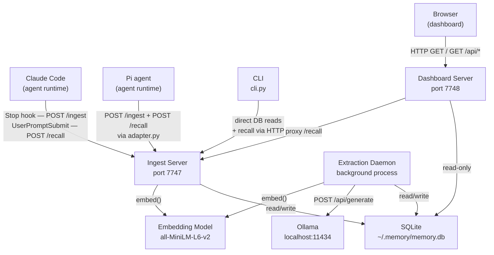
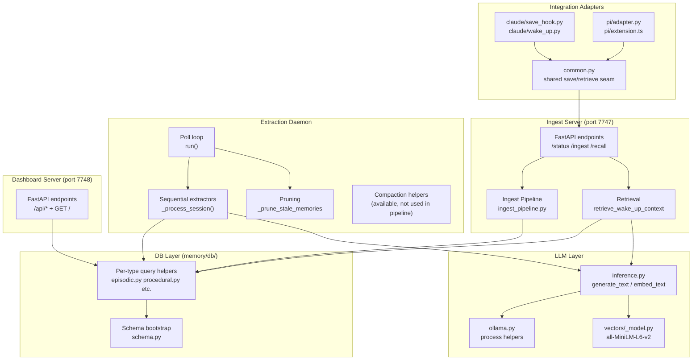
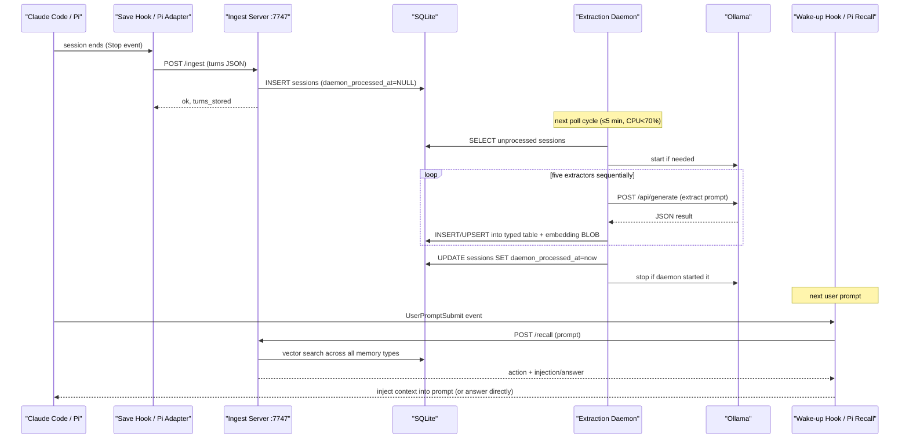

# agentic-memory — System Overview

---

## 1. Executive Summary

agentic-memory is a local, persistent memory system for AI agents. It captures the full transcript of every conversation session, extracts five complementary types of structured memory from each one (facts, episodes, procedures, working-memory snapshots, and session-memory handoffs), and injects the most relevant context into the next prompt — all without any LLM call at retrieval time.

The system installs as three always-on macOS launchd services: an extraction daemon, an ingest-and-recall HTTP server, and a dashboard HTTP server. Two integration adapters — one for Claude Code, one for the pi agent runtime — connect external agent sessions to the same ingest and retrieval seam.

---

## 2. Business Context

AI agent sessions are ephemeral: each new conversation starts from scratch. Without a memory layer, the agent cannot recognize returning users, recall prior decisions, resume interrupted work, or apply patterns learned in earlier sessions.

agentic-memory solves this by maintaining a local SQLite database of everything the agent has seen, organized into five typed stores that cover different recovery dimensions: durable facts (who the user is), episodic narrative (what happened), procedural how-to patterns (how to do recurring tasks), a working-memory snapshot (what the current goal and next step are), and a session-memory handoff (where a session was left off). Because retrieval requires no LLM call — only an embedding and a vector search — the cost of recalling context at the start of each prompt is measured in milliseconds, not seconds.

The system is an engineering tool for individual developers running local AI agents on macOS. There is no remote backend, no authentication, and no multi-user model. `[confirm]`

---

## 3. Repository Overview

| Property | Value |
|---|---|
| Language | Python 3 (3.8+ required; `install.sh:82`) |
| TypeScript | `integrations/pi/extension.ts` (pi extension only) |
| Frameworks | FastAPI + uvicorn (two HTTP servers) |
| Build tooling | None — manual `pip3 install` |
| Package layout | Single Python package tree; not a published artifact |
| Database | SQLite at `~/.memory/memory.db` |
| LLM runtime | Ollama (local, `http://localhost:11434`) |
| Embedding model | `all-MiniLM-L6-v2` (384-dim, sentence-transformers) |
| Deployment | macOS launchd — three `KeepAlive` services |

---

## 4. System Context

The diagram below shows agentic-memory as a single system interacting with its external callers and dependencies. All interactions are local-machine only.



---

## 5. High-Level Architecture

The diagram below shows the major internal components and the data paths between them. Internal module names are used where the code has no other name for a component.



### Component table

| Component | Responsibility | Source | Notes |
|---|---|---|---|
| Ingest Server | FastAPI app that accepts session transcripts and serves recall queries | `memory/servers/ingest_server.py` | Port 7747; holds singleton embedding model |
| Dashboard Server | FastAPI app serving the SPA and read-only admin API | `memory/servers/dashboard_server.py` | Port 7748; no write operations |
| Extraction Daemon | Background process that polls for unprocessed sessions and runs five extractors | `memory/daemon/__init__.py` | Respects CPU gate; restarts via launchd |
| Ingest Pipeline | Validates and stores a session transcript to SQLite | `memory/servers/ingest_pipeline.py` | Called by both ingest server and integration adapters |
| Retrieval | Builds a `WakeUpContext` from one prompt using shared embedding + ranked vector search | `memory/retrieval/_fetch.py` | Model-free at recall time |
| DB Layer | Schema bootstrap, migrations, and per-table query helpers | `memory/db/` | No ORM; raw SQLite with WAL mode |
| LLM Layer | Seam for Ollama text generation and embedding calls | `memory/llm/inference.py`, `memory/vectors/_model.py` | Retries, temperature pinning, JSON extraction |
| Integrations | Agent-specific adapters; Claude hooks and pi extension call the shared seam in `common.py` | `integrations/` | Save and recall policy lives only in `common.py` |
| CLI | Nine sub-commands for inspecting and managing the memory database | `cli.py` | No daemon interaction; direct DB reads |

---

## 6. Public Surface Summary

Full per-item detail lives in the unit documents. This section provides names and one-line purposes.

### Ingest Server — port 7747

| Method | Path | Purpose |
|---|---|---|
| `GET` | `/status` | Health check — returns DB path, embed model ready flag, and model name |
| `POST` | `/ingest` | Store a session transcript (session_id, agent, turns, started_at, metadata) |
| `POST` | `/recall` | Retrieve ranked memory context for a prompt; returns action + injection or answer |

### Dashboard Server — port 7748

| Method | Path | Purpose |
|---|---|---|
| `GET` | `/` | Serve `dashboard.html` (single-page admin UI) |
| `GET` | `/api/sessions` | List sessions, paginated |
| `GET` | `/api/sessions/{id}` | Get one session with full transcript |
| `GET` | `/api/facts` | List extracted facts |
| `GET` | `/api/episodic` | List episodic memories |
| `GET` | `/api/procedural` | List procedural memories |
| `GET` | `/api/working_memory` | List working-memory snapshots |
| `GET` | `/api/session_memory` | List session-memory entries |
| `GET` | `/api/logs/{source}` | Tail a named log file |
| `POST` | `/api/process-one` | Trigger one manual extraction pass |
| `GET` | `/api/activity-stats` | Parsed activity.log: LLM calls avoided, estimated tokens saved |
| `GET` | `/api/performance-stats` | Parsed activity.log: embedding/search/daemon latency percentiles |
| `GET` | `/api/ollama-status` | Check whether Ollama is reachable |
| `POST` | `/api/start-ollama` | Start Ollama if not running |

### CLI — `cli.py`

| Command | Purpose |
|---|---|
| `bootstrap` | Create DB schema at `~/.memory/memory.db` |
| `status` | Print counts for all memory types |
| `search <query>` | Full-text search over session transcripts |
| `semantic <query>` | Cosine-similarity search over sessions |
| `get-session <id>` | Print one session as JSON |
| `tail [n]` | Print N most recent sessions (default 10) |
| `add-fact <entity> <attribute> <value>` | Insert a manual fact |
| `delete-fact <fact_id>` | Delete a fact by ID |
| `dashboard` | Open the dashboard in a browser |

### Claude Code hooks

| Event | Handler | Purpose |
|---|---|---|
| `Stop` | `integrations/claude/save_hook.py` | Parse JSONL transcript and save session to DB via `common.py` |
| `UserPromptSubmit` | `integrations/claude/wake_up.py` | Retrieve memory context and inject or answer via `common.py` |

### Pi integration

| Interface | File | Purpose |
|---|---|---|
| Pi extension (TypeScript) | `integrations/pi/extension.ts` | Intercept prompts; call Python adapter for recall and save |
| Python bridge | `integrations/pi/adapter.py` | Expose recall and save to the TypeScript extension via `common.py` |

### Shared seam

| Module | Purpose |
|---|---|
| `integrations/common.py` | Single-source save/retrieve policy; all adapters call this instead of re-implementing DB logic |

---

## 7. Key Workflows

### 7.1 Session ingest

**Trigger:** Claude Code fires its `Stop` hook at the end of every session, or the pi extension calls `/ingest` after each turn.

**Steps:**

1. The integration adapter reads the session transcript and calls `save_session_to_memory()` in `integrations/common.py:70`.
2. `common.py` calls `ingest_session()` in `memory/servers/ingest_pipeline.py`.
3. The pipeline validates the turn list (must be non-empty; roles must be `user` or `assistant`; `memory/servers/ingest_server.py:169,184`) and upserts the session row in the `sessions` table with `daemon_processed_at = NULL`.
4. The session is now stored and eligible for extraction. The adapter returns immediately — no LLM call is made during ingest.

**Failure:** If the SQLite write fails, the adapter logs the error and the session is not stored. There is no retry at the adapter layer. `[confirm]` whether loss is acceptable here.

---

### 7.2 Background extraction

**Trigger:** The daemon polls every 5 minutes when sessions were processed in the last cycle, or every 30 minutes otherwise (`memory/daemon/_core.py:18-19`).

**Steps:**

1. At startup, `run()` in `memory/daemon/__init__.py:457` bootstraps the DB and warms up the embedding model.
2. Before each cycle, the daemon reads CPU usage via `psutil.cpu_percent`. If usage exceeds 70 %, the cycle is skipped (`memory/daemon/__init__.py:474`).
3. `_run_unprocessed_batch()` calls `_prune_stale_memories()` then fetches up to 10 unprocessed sessions.
4. Ollama is started if not already running (`memory/llm/ollama.py:33`).
5. For each session, `_process_session()` runs five extractors **sequentially** in this order: facts, working memory, session memory, episodic, procedural (`memory/daemon/__init__.py:342-348`).
6. Each extractor calls `generate_text()` via Ollama, parses the JSON result, embeds the extracted record, and writes it to its respective table.
7. After all five extractors complete, `mark_session_processed()` sets `daemon_processed_at` on the session row.
8. Ollama is stopped after the batch if the daemon started it.

**SIGTERM / SIGINT:** The `_shutdown` flag is set; the daemon finishes the current extractor call and exits cleanly (`memory/daemon/__init__.py:86-92`).

**Extraction timeout:** Individual Ollama calls are bounded by `MEMORY_EXTRACTION_TIMEOUT_SECONDS` (default 600 s) (`memory/daemon/__init__.py:83`).

---

### 7.3 Wake-up retrieval (prompt enrichment)

**Trigger:** Claude Code fires its `UserPromptSubmit` hook before every user message. The pi extension calls `/recall` before every prompt.

**Steps:**

1. The integration adapter calls `retrieve_prompt_memory()` in `integrations/common.py:92`.
2. `retrieve_wake_up_context()` in `memory/retrieval/_fetch.py:127` embeds the prompt once via `embed_text()` — the only computation step.
3. Five memory types are searched sequentially: working memory (by `session_id`, no vector search), then episodic, facts, procedural, and session memory — each via a cosine-similarity scan over stored embeddings (`memory/retrieval/_fetch.py:147-160`).
4. Each result set is ranked by `_rank_rows()`, which blends semantic similarity (dominant), lexical token overlap (0.10 weight), and exponential recency decay (0.05 weight) (`memory/retrieval/_rank.py:64-75`).
5. Results are capped to type-specific limits: 2 episodic, 3 facts, 2 procedural, 2 session-memory records (`memory/retrieval/_models.py:13-23`).
6. If no episodic or session-memory records are found and the prompt resembles a "where did we leave off" query, the daemon fetches the most recent substantive episodes as a fallback (`memory/retrieval/_fetch.py:162`).
7. `decide_prompt_memory_action()` in `integrations/common.py:125` decides:
   - **answer** — if only facts were found (no contextual memory), the fact content is rendered as a direct response and no LLM call is needed.
   - **inject** — if contextual memory exists, a formatted injection string is built and returned to the agent runtime as `additionalContext`.
   - **noop** — if nothing was found.

---

## 8. Business Rules

| Rule | Implementation | Source | Notes |
|---|---|---|---|
| Turn roles must be `user` or `assistant` | Pydantic validator raises `ValueError` on any other value | `memory/servers/ingest_server.py:169` | Enforces schema integrity; rationale not documented `[confirm]` |
| Sessions with zero turns are rejected | Pydantic validator raises `ValueError` | `memory/servers/ingest_server.py:184` | |
| CPU gate: skip extraction above 70 % CPU | `psutil.cpu_percent > CPU_THRESHOLD` check before each daemon cycle | `memory/daemon/__init__.py:474`, `memory/daemon/_core.py:20` | Prevents background extraction from interfering with active work |
| Extraction timeout: 600 s per session | `MEMORY_EXTRACTION_TIMEOUT_SECONDS` default; each extractor passes this to Ollama | `memory/daemon/__init__.py:83` | Env-overridable |
| Fact TTL: 180 days | `prune_stale_facts(conn, days=180)` called each daemon cycle | `memory/daemon/pruning.py:14`, `memory/daemon/_core.py:24` | Env-overridable via `MEMORY_FACT_TTL_DAYS` |
| Episodic TTL: 90 days | `prune_stale_episodic(conn, days=90)` called each daemon cycle | `memory/daemon/pruning.py:15`, `memory/daemon/_core.py:25` | Env-overridable via `MEMORY_EPISODIC_TTL_DAYS` |
| One episodic and one procedural record per session | Unique index enforced on `session_id` in both tables; migration deduplicates existing rows | `memory/db/schema.py:79-81` | |
| Similarity threshold gates retrieval per memory type | Episodic ≥ 0.58, facts ≥ 0.38, procedural ≥ 0.58, session memory ≥ 0.60 | `memory/retrieval/_models.py:11-22` | Lower threshold for facts matches durable user attributes at moderate similarity |
| "Missing memory" episodes are suppressed | Episodes whose title or abstract contain phrases like "no memory", "not stored in" etc. receive a −0.25 score penalty and are excluded from ranking | `memory/retrieval/_rank.py:21-33` | Prevents LLM hallucination artifacts from polluting retrieval |
| Substantive episodes get a scoring bonus | Episodes with ≥ 2 populated detail fields (decisions, outcomes, follow_ups) receive +0.03 | `memory/retrieval/_rank.py:36-38,71` | |
| Extractors run on raw transcript, not on compacted text | `_get_or_compact_session_text()` bypasses the LLM summarizer and returns `_session_text_sample()` directly | `memory/daemon/compaction.py:75-83` | Prevents hallucinated details from entering stored memory; compaction helper is retained but not called in the pipeline |
| Retrieval excludes the current session from session-memory results | `exclude_session_id=session_id` passed to `retrieve_session_memories()` | `memory/retrieval/_fetch.py:119` | Prevents the current session from injecting its own handoff |

---

## 9. Dependencies

| Dependency | Purpose | Protocol | Endpoint | Calling component | Failure behavior |
|---|---|---|---|---|---|
| Ollama | Local LLM text generation (extraction only) | HTTP POST | `http://localhost:11434/api/generate` | `memory/llm/inference.py`, `memory/llm/ollama.py` | Retries up to 3 times with exponential backoff (1 s wait after attempt 1, 2 s wait after attempt 2); raises `InferenceError` after exhaustion; daemon logs the error and marks session unprocessed `[inferred]` |
| all-MiniLM-L6-v2 | 384-dimensional text embedding (ingest server, daemon, CLI) | In-process (sentence-transformers) | Local HuggingFace cache `~/.cache/huggingface` | `memory/vectors/_model.py` | Raises `ImportError` if library not installed; raises `RuntimeError` if model not in local cache (offline mode enforced) — `memory/vectors/_model.py:35-41` |
| SQLite | Persistent storage for all memory types | In-process (sqlite3) | `~/.memory/memory.db` | `memory/db/` | WAL mode, `busy_timeout = 5000 ms` — `memory/db/schema.py:88`; callers handle `OperationalError` |

Python library dependencies (no pinned versions): `sentence-transformers`, `fastapi`, `uvicorn`, `pydantic`, `psutil`, `setproctitle`, `debugpy` (`install.sh:93`). No lockfile exists; exact versions are determined at install time.

---

## 10. Data Storage

**Technology:** SQLite, WAL journal mode, `busy_timeout = 5000 ms`, `synchronous = NORMAL` (`memory/db/schema.py:85-95`).
**Path:** `~/.memory/memory.db`
**ORM:** None — raw SQL queries throughout `memory/db/`.

### Tables

| Table | Purpose | Key columns | Notes |
|---|---|---|---|
| `sessions` | Raw session transcripts | `session_id` (PK), `agent`, `started_at`, `updated_at`, `turn_count`, `transcript` (JSON), `daemon_processed_at` | `daemon_processed_at IS NULL` is the extraction queue predicate |
| `facts` | Durable entity-attribute-value triples | `id` (PK), `entity`, `attribute`, `value`, `semantic_content`, `embedding` (BLOB), `session_id`, `tags`, `created_at` | Two text representations: canonical (`entity.attribute = value`) and semantic (for embedding/retrieval) |
| `episodic_memory` | One narrative per session | `id` (PK), `session_id` (UNIQUE indexed), `title`, `abstract`, `happened_at`, `details` (JSON), `embedding` | Unique constraint enforced by migration |
| `procedural_memory` | One how-to pattern per session | `id` (PK), `session_id` (UNIQUE indexed), `title`, `summary`, `updated_at`, `details` (JSON), `embedding` | Unique constraint enforced by migration |
| `working_memory` | One goal snapshot per session | `id` (PK), `session_id` (UNIQUE), `current_goal`, `current_focus`, `next_step`, `status`, `updated_at`, `details` (JSON), `embedding` | |
| `session_memory` | One handoff record per session | `id` (PK), `session_id` (UNIQUE), `title`, `summary`, `left_off_at`, `updated_at`, `details` (JSON), `embedding` | Contains `next_steps` in `details` JSON |

### Embeddings

Every memory record stores a 384-dimensional float vector in a BLOB column. The vector is packed/unpacked using `struct` (`memory/vectors/__init__.py` — `[inferred]` from module structure). Cosine similarity search is performed in-process over all stored vectors (no vector database — linear scan `[inferred]`).

### Data lifecycle

- Facts are pruned when older than `_FACT_TTL_DAYS` (default 180) each daemon cycle (`memory/daemon/pruning.py:14`).
- Episodic memories are pruned when older than `_EPISODIC_TTL_DAYS` (default 90) each daemon cycle (`memory/daemon/pruning.py:15`).
- Procedural memory, working memory, and session memory have no TTL. `[confirm]` whether this is intentional.
- Sessions are never deleted. `daemon_processed_at` is set to mark them as processed.

### Migrations

Forward-only migrations are applied at every startup by `_apply_migrations()` (`memory/db/schema.py:98-107`). `OperationalError` (e.g., "column already exists") is silently ignored, making each migration idempotent.

---

## 11. Security

**Authentication:** None. All three services bind to `127.0.0.1` (`memory/servers/ingest_server.py:307`) and are not exposed to the network. No API keys, tokens, or user authentication exist. `[confirm]` that local-only binding is intentional and enforced at the OS level.

**CORS:** The ingest server allows `POST` and `GET` from two origins by default: `https://copilot.microsoft.com` and `https://github.com` (`memory/servers/ingest_server.py:153`). Override via `MEMORY_INGEST_CORS_ORIGINS`. The dashboard server does not expose CORS headers `[inferred]`.

**Secrets:** No secrets, tokens, or credentials are stored or transmitted. Ollama and SQLite are both local processes.

**Data at rest:** All extracted memory is stored in plain-text SQLite. The embedding BLOBs are floating-point vectors. No encryption at rest. `[confirm]`

---

## 12. Observability

### Log files under `~/.memory/`

| File | Content | Format |
|---|---|---|
| `activity.log` | Structured events from all components: retrieval timings, extractor timings, pruning, session processing, memory answers | JSON-lines (`memory/utils/logger.py:44-54`) |
| `error.log` | Errors with stack-trace repr | JSON-lines (`memory/utils/logger.py:58-68`) |
| `daemon.log` | Human-readable daemon progress messages; also receives stdout/stderr from the launchd daemon service | Plain text with UTC timestamps |
| `ingest.log` | HTTP request/response summaries for `/ingest` and `/recall`; also receives ingest server stdout/stderr | Plain text with UTC timestamps |
| `wake_up.log` | Wake-up hook trace | Plain text |
| `save_hook.log` | Save-hook ingest trace | Plain text |
| `facts.log` | Fact extraction and retrieval trace | Plain text |
| `episodic.log` | Episode extraction and retrieval trace | Plain text |
| `procedural.log` | Procedural extraction trace | Plain text |
| `working_memory.log` | Working-memory extraction and retrieval trace | Plain text |
| `session_memory.log` | Session-memory extraction and retrieval trace | Plain text |

Log rotation is installed as a daily launchd job (`com.memory.logrotate`) at 03:17 local time, archiving into `~/.memory/log-archive` and retaining 7 days (`install.sh:408-443`).

### Health check

`GET /status` on port 7747 returns `embed_model_ready: true/false` and the DB path (`memory/servers/ingest_server.py:199-207`).

### Activity stats

The dashboard exposes two derived endpoints that parse `activity.log`:
- `/api/activity-stats` — counts `memory_answer` actions to report LLM calls avoided and estimated tokens saved (`dashboard_server.py` — `[inferred]` from recon).
- `/api/performance-stats` — computes average and P95 latency for recall embedding, memory search, and daemon session processing.

### Timing fields

`WakeUpContext.timings` carries three fields per retrieval: `prompt_embedding_ms`, `memory_search_ms`, `retrieval_total_ms` (`memory/retrieval/_fetch.py:173-179`). These are logged to `activity.log` by `retrieve_prompt_memory()` in `integrations/common.py:104`.

### Absence of distributed tracing

No OpenTelemetry, no trace IDs, no Datadog/Prometheus integration. All observability is file-based.

---

## 13. Error Handling

| Failure scenario | Detection | System behavior | Retry |
|---|---|---|---|
| Ollama unavailable during extraction | `urllib.error.URLError` in `generate_text()` | Retries 3× with exponential backoff (1 s then 2 s between attempts); raises `InferenceError` on exhaustion | Yes — `memory/llm/inference.py:67-82` |
| Embedding model not installed | `ImportError` in `memory/vectors/_model.py:21` | Raises with install instructions | No |
| Embedding model not in local cache | `RuntimeError` in `memory/vectors/_model.py:39-41` | Raises with cache instructions | No |
| Extractor failure for one session | Any `Exception` in `_process_session()` | Error logged; `RuntimeError` re-raised; session not marked processed; daemon moves to next session | No — session retried on next daemon cycle |
| Any retrieval step failure | Any `Exception` in `_retrieve_*` helpers | Caught; `RetrievalWarning` appended; empty list returned; retrieval continues | No — `memory/retrieval/_fetch.py:52,62,71,87` |
| SQLite busy | `busy_timeout = 5000 ms` causes a wait then `OperationalError` | Propagated to caller | No |
| DB does not exist yet | `os.path.exists()` check in `open_memory_db_for_ingest()` | `bootstrap_db()` called to create schema | n/a |
| Ingest with empty turns | Pydantic `ValueError` | HTTP 422 Unprocessable Entity returned to caller | No |
| Invalid turn role | Pydantic `ValueError` | HTTP 422 Unprocessable Entity returned to caller | No |

---

## 14. Resiliency

**CPU gate.** The daemon reads `psutil.cpu_percent(interval=1)` before each poll cycle and sleeps for 60 s if CPU exceeds 70 % (`memory/daemon/__init__.py:474`). This prevents background extraction from degrading interactive agent sessions.

**Ollama lifecycle management.** The daemon starts Ollama if not running and stops it after each extraction batch (`memory/daemon/__init__.py:402-420`). If Ollama does not become ready within 12 s, the daemon kills it and skips LLM processing for that batch (`memory/llm/ollama.py:55-66`).

**Graceful degradation in retrieval.** Every retrieval sub-function wraps its DB call in `try/except` and returns an empty list plus a `RetrievalWarning` on any failure (`memory/retrieval/_fetch.py`). A broken episodic lookup does not prevent facts or procedural memory from being returned.

**Fallback to recent episodes.** If neither episodic nor session-memory records are found, the daemon checks whether the prompt resembles a "where did we leave off" query and falls back to the N most recent substantive episodes (`memory/retrieval/_fetch.py:162`).

**Offline embedding.** `HF_HUB_OFFLINE=1` and `TRANSFORMERS_OFFLINE=1` are set unconditionally at model load time (`memory/vectors/_model.py:7-8`), preventing any network call during inference.

**SIGTERM handling.** The daemon installs a signal handler that sets `_shutdown = True`; the loop exits cleanly after the current extractor finishes (`memory/daemon/__init__.py:86-92`).

**launchd `KeepAlive`.** All three services are declared with `KeepAlive = true` in their launchd plists, so macOS restarts them automatically on crash or reboot (`install.sh:290-312`).

**WAL mode + busy timeout.** SQLite WAL mode allows concurrent reads during writes. `busy_timeout = 5000 ms` reduces the chance of `SQLITE_BUSY` errors when the daemon and ingest server access the DB simultaneously (`memory/db/schema.py:88-93`).

---

## 15. Performance and Scalability

**Retrieval latency.** Retrieval requires one embedding call (in-process, sentence-transformers) and linear cosine-similarity scans over all stored vectors. No external network call is made. Timing fields are written to `activity.log`; P95 latency is available from `/api/performance-stats`. No SLA is published. `[unknown]`

**Extraction throughput.** Five extractors run **sequentially** per session (`memory/daemon/__init__.py:342-376`). Each extractor makes one blocking Ollama HTTP call. Wall-clock time per session depends on Ollama throughput (typically seconds to tens of seconds for `qwen2.5:7b` on consumer hardware `[inferred]`). Sessions are processed in batches of 10 (`memory/daemon/__init__.py:397`).

**Embedding model loading.** The model is loaded once on first call and cached for the process lifetime (`memory/vectors/_model.py:16`). The daemon warms up the model at startup (`memory/daemon/pruning.py:30`).

**SQLite concurrency.** SQLite WAL mode supports one writer and multiple concurrent readers. The daemon (writer during extraction), ingest server (writer during ingest, reader during recall), and dashboard server (reader only) can all operate simultaneously. Writes contend only during the brief `INSERT`/`UPDATE` per extractor result.

**Scalability limits.** The system is single-machine, single-user, and single-database. There is no horizontal scaling mechanism. Vector search is a linear scan; retrieval latency grows with the number of stored records. `[confirm]` whether this is a known limitation.

---

## 16. Deployment and Infrastructure

**Platform:** macOS only (launchd services, `~/Library/LaunchAgents`). No Docker, Kubernetes, or cloud infrastructure.

**Installation:** Run `./install.sh` from the repository root. The script:
1. Verifies Python 3.8+ (`install.sh:82-86`).
2. Installs Python dependencies with `pip3 install --user` (`install.sh:93`).
3. Pulls the Ollama model (`qwen2.5:7b` by default; falls back to a HuggingFace GGUF download) (`install.sh:119-176`).
4. Creates `~/.memory/` and an optional `~/.memory/identity.md` user profile.
5. Adds `Stop` and `UserPromptSubmit` hooks to `~/.claude/settings.json` (`install.sh:240-253`).
6. Installs a pi extension wrapper at `~/.pi/agent/extensions/agentic-memory.ts` (`install.sh:260-266`).
7. Writes and loads four launchd plists: `com.memory.daemon`, `com.memory.ingest`, `com.memory.query`, `com.memory.logrotate` (`install.sh:268-443`).

**Uninstallation:** `./install.sh --uninstall` removes hooks, the pi extension, and launchd plists. Data in `~/.memory/` is always preserved.

**Service supervision:**

| Service label | Runs | Port | Log |
|---|---|---|---|
| `com.memory.daemon` | `python3 -m memory.daemon` | — | `~/.memory/daemon.log` |
| `com.memory.ingest` | `python3 -m memory.servers.ingest_server` | 7747 | `~/.memory/ingest.log` |
| `com.memory.query` | `python3 -m memory.servers.dashboard_server` | 7748 | `~/.memory/query.log` |
| `com.memory.logrotate` | `scripts/rotate-memory-logs.sh` | — | daily at 03:17 |

All four services are marked `RunAtLoad = true` and `KeepAlive = true`, meaning they start on login and restart automatically on failure.

**PYTHONPATH.** The install script captures the user's site-packages path at install time and writes it into each launchd plist's `EnvironmentVariables`. This ensures launchd's minimal environment resolves the correct Python interpreter and user-installed packages (`install.sh:275-299`).

**CI/CD:** A `.github/` directory exists. CI pipeline details were not examined. `[unknown]`

---

## 17. Configuration

All configuration is via environment variables. None are required — every variable has a default.

| Variable | Purpose | Default | Set in |
|---|---|---|---|
| `MEMORY_OLLAMA_MODEL` | Ollama model name for all extraction | `qwen2.5:7b` | `memory/llm/inference.py:21`; launchd plists |
| `MEMORY_OLLAMA_RETRIES` | Maximum Ollama retry attempts | `3` | `memory/llm/inference.py:23` |
| `MEMORY_EXTRACTION_TIMEOUT_SECONDS` | Per-extractor Ollama call timeout | `600` | `memory/daemon/__init__.py:83` |
| `MEMORY_INGEST_PORT` | Ingest server port | `7747` | `memory/servers/ingest_server.py:35` |
| `MEMORY_QUERY_PORT` | Dashboard server port | `7748` | `memory/servers/dashboard_server.py:27` |
| `MEMORY_INGEST_CORS_ORIGINS` | Comma-separated allowed CORS origins | `https://copilot.microsoft.com,https://github.com` | `memory/servers/ingest_server.py:153-155` |
| `MEMORY_FACT_TTL_DAYS` | Days before facts are pruned | `180` | `memory/daemon/_core.py:24` |
| `MEMORY_EPISODIC_TTL_DAYS` | Days before episodic memories are pruned | `90` | `memory/daemon/_core.py:25` |
| `MEMORY_COMPACT_INPUT_CHARS` | Maximum raw transcript chars fed to the summarizer | `40000` | `memory/daemon/_core.py:28` |
| `MEMORY_COMPACT_OUTPUT_CHARS` | Target summary length for the summarizer | `5000` | `memory/daemon/_core.py:30` |
| `MEMORY_DISABLE_FILE_LOGS` | Suppress file log writes when set to `1` (used by tests) | unset | `memory/daemon/_core.py:38` |
| `HF_HUB_OFFLINE` | Prevent HuggingFace network calls | `1` (forced) | `memory/vectors/_model.py:7` |
| `TRANSFORMERS_OFFLINE` | Prevent transformers network calls | `1` (forced) | `memory/vectors/_model.py:8` |

---

## 18. Testing

The test suite uses `pytest`. Tests suppress file-log writes via `MEMORY_DISABLE_FILE_LOGS=1` in `conftest.py` (`tests/conftest.py:4`).

```bash
pytest -q
```

### Test coverage by category

| Category | Files | What is covered |
|---|---|---|
| Fixture-based extraction | `test_*_extraction_fixtures.py` (facts, episodic, procedural, working memory, session memory) | LLM extraction output parsing against expected JSON fixtures for specific session transcripts |
| Contract tests | `test_contracts_*.py` (facts, episodic, procedural, working memory, session memory) | Structural invariants each memory type must satisfy |
| Repository tests | `test_*_repository.py` (episodic, fact, procedural, working memory, session memory) | DB read/write behavior for each memory type |
| Retrieval tests | `test_retrieval.py`, `test_semantic_search.py` | Wake-up context assembly, ranking logic, injection format, semantic search over sessions |
| DB tests | `test_db.py`, `test_token_economics.py` | Schema bootstrap, migration idempotency, `log_retrieval` compatibility no-op |
| Server tests | `test_ingest.py`, `test_ingest_pipeline.py`, `test_dashboard_server.py` | Ingest and recall HTTP endpoints; dashboard API |
| CLI tests | `test_cli.py` | CLI command behavior |
| Integration adapter tests | `test_integrations_common.py`, `test_save_hook.py`, `test_wake_up.py`, `test_pi_adapter.py` | Adapter-level save/recall policy |
| Daemon tests | `test_daemon.py` | Extraction pipeline, session processing, CPU gate |
| Logging tests | `test_logger.py` | Activity and error log format |

### Notable edge cases encoded in tests

- `test_retrieval.py:TestBuildWakeUpInjection.test_returns_empty_when_no_sections_exist` — injection returns empty string when all memory fields are empty.
- `test_token_economics.py` — confirms that `log_retrieval()` is a no-op and the `retrievals` table does not exist.
- Fixture files in `tests/fixtures/facts/sessions/` and `tests/fixtures/facts/expected/` encode expected extraction outputs for six named scenarios including feature requests, role statements, and embedded context.

---

## 19. End-to-End Data Flow

The diagram below traces data from an agent session through ingest, background extraction, and retrieval injection.



---

## 20. Operational Guide

### First-time setup

```bash
# Install all dependencies and services
./install.sh

# Then restart Claude Code / Pi for hooks to take effect
```

### Manual service management

```bash
# Start services
launchctl load ~/Library/LaunchAgents/com.memory.daemon.plist
launchctl load ~/Library/LaunchAgents/com.memory.ingest.plist
launchctl load ~/Library/LaunchAgents/com.memory.query.plist

# Stop services
launchctl unload ~/Library/LaunchAgents/com.memory.daemon.plist
launchctl unload ~/Library/LaunchAgents/com.memory.ingest.plist
launchctl unload ~/Library/LaunchAgents/com.memory.query.plist

# Or use helper scripts
./scripts/start-memory.sh
./scripts/restart-memory.sh
./scripts/stop-memory.sh
```

### Check system status

```bash
# Health check
curl http://localhost:7747/status

# Memory counts
python3 cli.py status

# Open dashboard
python3 cli.py dashboard
# → http://localhost:7748
```

### Database bootstrap (first time only)

```bash
python3 cli.py bootstrap
```

### One-off extraction pass

```bash
python3 -m memory.daemon --once
```

### Schema migrations (after upgrades)

```bash
# Migrate fact semantic text (one-time)
python3 scripts/migrate_facts_semantic_text.py --db ~/.memory/memory.db

# Backfill procedural memory for older sessions
python3 scripts/backfill_procedural_memory.py --db ~/.memory/memory.db --dry-run
python3 scripts/backfill_procedural_memory.py --db ~/.memory/memory.db
```

### Important logs

| What to check | Command |
|---|---|
| Daemon activity | `tail -f ~/.memory/daemon.log` |
| Ingest/recall traffic | `tail -f ~/.memory/ingest.log` |
| Extraction events | `tail -f ~/.memory/activity.log` |
| Errors | `tail -f ~/.memory/error.log` |

---

## 21. Troubleshooting

| Symptom | Possible cause | Where to look | Resolution |
|---|---|---|---|
| `/status` returns `embed_model_ready: false` | `all-MiniLM-L6-v2` not in local HuggingFace cache | `~/.memory/ingest.log`, `memory/vectors/_model.py:35-41` | Run `python3 -c "from sentence_transformers import SentenceTransformer; SentenceTransformer('all-MiniLM-L6-v2')"` once while online to populate the cache |
| Sessions not being extracted after many minutes | Ollama not installed, CPU consistently above 70 %, or daemon not running | `~/.memory/daemon.log`, `launchctl list \| grep memory` | Check `launchctl list com.memory.daemon`; check CPU; verify `ollama` is in PATH |
| Recall returns `action: noop` for every prompt | No sessions ingested yet, or daemon has not processed sessions, or similarity thresholds not met | `python3 cli.py status`, `~/.memory/activity.log` | Check session and memory type counts; trigger `--once` pass |
| Ollama extraction very slow | Large session transcripts + slow hardware | `~/.memory/daemon.log`, extractor timing in `activity.log` | Consider reducing `MEMORY_COMPACT_INPUT_CHARS`; upgrade hardware |
| `SQLITE_BUSY` errors | Daemon and ingest server contending under high load | `~/.memory/error.log` | The 5 s `busy_timeout` should handle bursts; check for runaway processes |
| Wake-up hook firing but no injection | No memory above similarity thresholds for this prompt | `~/.memory/wake_up.log`, `activity.log` recall_timing entries | Normal for early sessions; extraction fills over time |
| Dashboard not loading | Dashboard server not running | `launchctl list com.memory.query`, `~/.memory/query.log` | Reload plist: `launchctl load ~/Library/LaunchAgents/com.memory.query.plist` |
| Missing procedures after adding sessions | No procedural pattern in session content; extractor returned `None` | `~/.memory/daemon.log` — "no procedural memory extracted" | Expected — not every session contains reusable how-to content |

---

## 22. Architecture Characteristics

**Local-first, offline-capable.** All computation — embedding, LLM inference, storage — runs on the local machine. The only network call is to Ollama's local HTTP port. Offline mode is enforced for the HuggingFace model cache.

**Decoupled write and extraction.** Session ingest is a synchronous SQLite write; extraction is asynchronous and deferred to the background daemon. Agent sessions are never blocked by LLM extraction time.

**Model-free retrieval.** Retrieval requires no LLM call. Intelligence is pre-baked into stored extractions at daemon time; runtime recall is embedding + vector scan + string formatting.

**Single-tenant, single-machine.** No multi-user model, no authentication, no network exposure beyond localhost. Designed for individual developer use.

**Typed memory stores.** Five complementary memory types cover different recovery dimensions. Each type is a separate table with a dedicated extractor, repository, and retrieval path. They do not share a generic key-value store.

**Coordinator-less extraction.** The daemon owns the extraction pipeline but no coordination protocol exists between the daemon and the ingest server. Mutual exclusion is achieved by SQLite WAL mode and `busy_timeout`.

**No event bus or message queue.** The "queue" for extraction work is the `daemon_processed_at IS NULL` predicate on the `sessions` table. No external broker is involved.

**Sequential extraction pipeline.** Extractors run in a fixed order (facts → working memory → session memory → episodic → procedural) within a single daemon process thread. This simplifies error isolation but means total extraction time is the sum of all five extractor call times.

---

## 23. Documentation Drift

The following discrepancies were found between `README.md` and the current implementation:

| Location | README claim | Implementation reality |
|---|---|---|
| README "Parallel session processing" | "ThreadPoolExecutor(max_workers=5) runs all five extractors concurrently" | Extractors run **sequentially** in `_process_session()` via a plain `for` loop — `memory/daemon/__init__.py:342-376`. No `ThreadPoolExecutor` is present in the current code. |
| README "Components" section, file paths | References `memory/daemon.py`, `memory/ingest_server.py`, `memory/dashboard_server.py` at top-level | After the module layout refactor, these live at `memory/daemon/__init__.py`, `memory/servers/ingest_server.py`, and `memory/servers/dashboard_server.py`. The README paths are stale. |
| `com.memory.daemon.plist`, `com.memory.ingest.plist`, `com.memory.query.plist` (template files in repo root) | Contain `__PYTHON3__`, `__INSTALL_DIR__`, `__HOME__` placeholders | These templates are never read by the running system. `install.sh` writes the actual plists directly to `~/Library/LaunchAgents/` with real paths at install time. The template plists also reference the old file paths (`memory/daemon.py`, `memory/ingest_server.py`, `memory/dashboard_server.py`) rather than the refactored module paths. |

---

## 24. Glossary

| Term | Definition |
|---|---|
| **Session** | One Claude Code or pi agent conversation, stored as a JSON array of turns in the `sessions` table |
| **Turn** | One message in a session with a `role` (`user` or `assistant`) and a `content` string |
| **Fact** | A durable structured triple: `entity` + `attribute` + `value` (e.g., `user.name = Yash`). Stored with both a canonical text form and a semantic text form for embedding |
| **Episode / Episodic memory** | A narrative summary of what happened in a session: title, abstract, decisions, outcomes, and follow-ups. One per session |
| **Procedure / Procedural memory** | A how-to pattern extracted from a session: title, summary, ordered steps, and trigger phrases. One per session |
| **Working memory** | A point-in-time snapshot of the active goal, current focus, next step, active tasks, constraints, and status in a session |
| **Session memory** | A compacted handoff record: `left_off_at` string plus `next_steps` list. Used to resume at the start of the next session |
| **Daemon** | The background launchd process that polls for unprocessed sessions and runs all five extractors (`memory/daemon/__init__.py`) |
| **Wake-up** | The retrieval event at the start of each user prompt: one embedding, five memory-type searches, ranking, and injection |
| **Ingest** | The act of writing a session transcript to SQLite via `POST /ingest` or the save hook |
| **Recall** | The act of retrieving ranked memory context for a prompt via `POST /recall` |
| **Compaction** | LLM-based summarization of a long session transcript to a shorter text. Available as a helper but not used in the current extraction pipeline |
| **Embedding** | A 384-dimensional float vector produced by `all-MiniLM-L6-v2` and stored as a BLOB in each memory table |
| **Semantic search** | Cosine-similarity search over stored embeddings |
| **Token budget** | A character limit applied during retrieval to keep injected context small |
| **Activity log** | `~/.memory/activity.log` — structured JSON-lines log with timing and count fields from all components |
| **WakeUpContext** | The dataclass that carries all retrieved memory for one prompt (facts, episodic, procedural, session memory, working memory, warnings, timings) — `memory/retrieval/_models.py:35` |
| **RecallOutcome** | The decision produced after retrieval: `answer` (direct fact answer), `inject` (context injection string), or `noop` — `integrations/common.py:24` |
| **CPU gate** | The daemon check that skips an extraction cycle when `psutil.cpu_percent > 70` |
| **Substantive episode** | An episodic record with at least 2 populated detail fields (decisions + outcomes + follow_ups ≥ 2). Gets a +0.03 ranking bonus |
| **Save hook** | The Claude Code `Stop` event handler that persists each session on conversation end |

---

*Generated from agentic-memory @ 7df34ac (refactor-integrations-pi-claude-memory) on 2026-09-18. Regenerate rather than hand-edit.*
